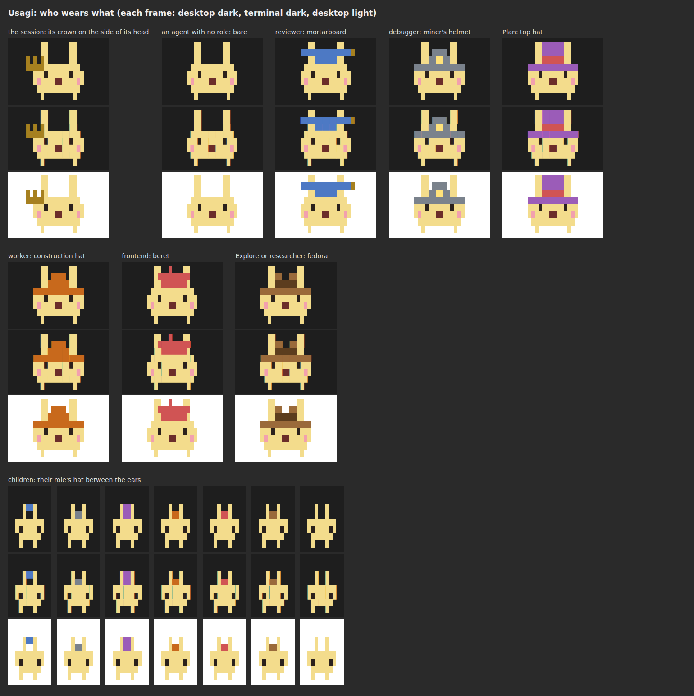
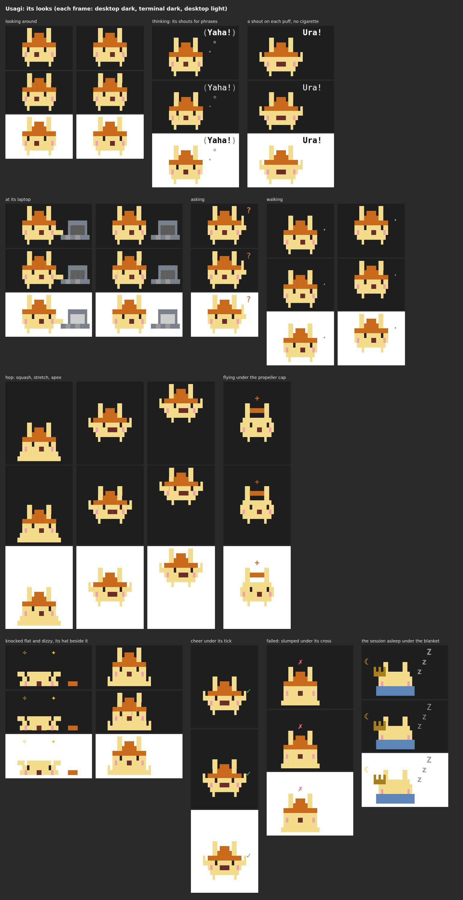
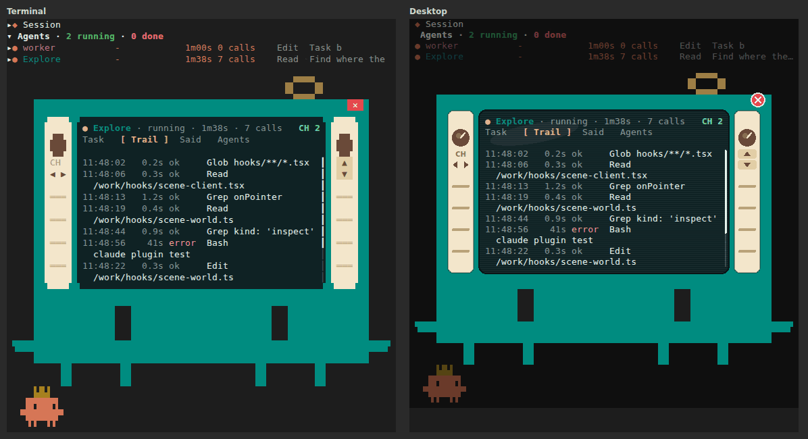
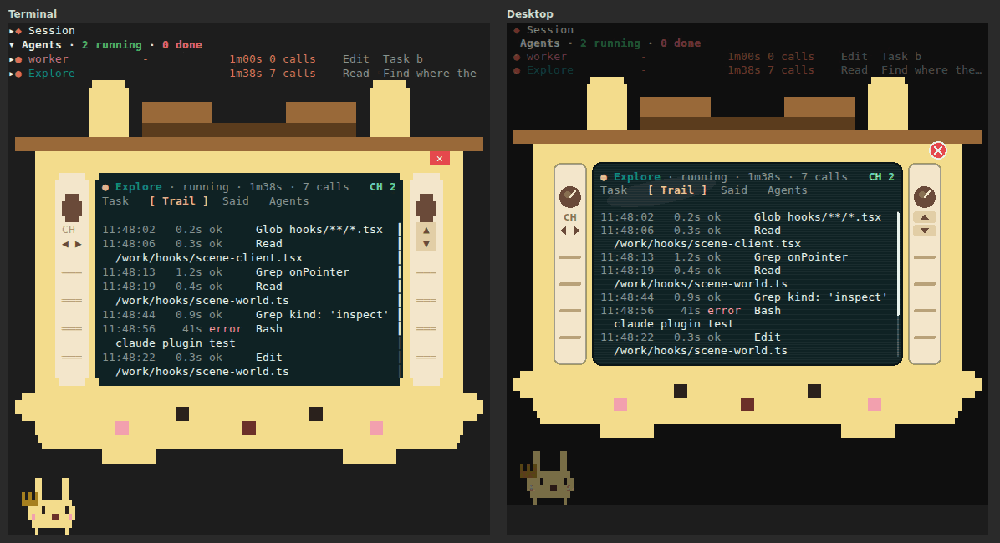

# mod-hud: the mascot scene

The scene fills the rows the `hud` pane has left under the agent list with
Claude Code mascots: the session's own, and one per subagent and workflow
agent. It is pure functions, in modules by layer: `hooks/mascot-sprites.ts`
the frame tables, `hooks/mascot-poses.ts` and `hooks/mascot-glyphs.ts` a
mascot's look and its cells, `hooks/motion-*.ts` the movement over the field
(wandering, hops, flights, collisions), `hooks/scene-pipe.ts` the red pipe
agents arrive and leave by, and `hooks/scene-*.ts` the scene:
`sceneOf(agents, hud, now, options)` (`hooks/scene-model.ts`) builds a
`MascotScene` from the board's entries, the workflow agents
(`options.shadows`), the HUD's facts, the main loop's activity and the
messages agents sent (`options.events`); `mascotPlan(scene, layout, previous)`
(`hooks/scene-plan.ts`) places everyone for a frame; `placedSprites()`
(`hooks/scene-placement.ts`) lists the placed sprites and marks as cells for
any renderer; and `renderMascots(ui, scene, layout, plan, pick)`
(`hooks/scene-render.tsx`) is the thin Box/Text adapter that draws them.

Two renderers draw the scene, chosen by the `motion` option and the surface:

- **The smooth scene** (`motion: smooth`, the default, on the terminal and
  the desktop): the pane draws a `Client` element, keyed `mascots`, and its
  surface module `hooks/scene-client.tsx` draws the scene. It runs on the
  surface's own frame clock, at 20 frames a second. It keeps all motion in
  its local state (`hooks/scene-world.ts`, `hooks/scene-view.ts`): the plans,
  the positions between cells, the bodies the person picks up and throws
  (`hooks/motion-physics.ts`). The hooks only hand it the
  scene's inputs as props (`sceneInputsOf`) on each of their redraws. See
  "Physics and controls".
- **The classic scene** (VS Code and mobile, which draw no `Client`, or
  `motion: classic` anywhere): `renderMascots` in the hooks' tree, on the
  hooks' 250 ms clock. The pane passes the previous `mascotPlan()` result
  into the next frame to keep slots, positions and the places farewells
  leave from. This per-surface cache is cleared when the scene clock stops; a
  resize starts a fresh classic layout. A smooth render removes only its own
  surface's classic plan; it never stops another surface's clock or clears
  that surface's plan.

Where the smooth scene is drawn in pixels (the desktop app, and a terminal
that shows pictures: Ghostty, kitty), the `mascotArt` option (`vector`, the
default) draws the mascots as shapes in eased poses instead of the cells'
blocks; see "The vector art". Text-only terminals draw the blocks either way.

`mascotLines()` returns the classic drawing as plain text. Every frame below
is its output (`spriteSheet()`).

The `mascots` option (on by default) switches all of it off: no scene, no
name colours, no scene clock, no raised hands and no compaction stamp
(`main.compactedAt`). What the HUD reads stays tracked whatever it says: the
main loop's busy and idle times (`main.busySince`, `main.idleSince`), a
subagent's lingering permission ask (the `tool.check` hook, for the alert
strip's count) and the files edited (the Session tab's Overview).
`wander` (on) lets mascots roam the field between tools, `scenes` (on) plays
the orchestration scenes, and `collisions` (`rare`) sets how mascots that meet
behave; see "Choreography". `motion` (`smooth`) picks the renderer: `classic`
keeps the Box/Text scene on every surface. `character` (`clawd`) picks who
the mascots are: Clawd, as the rest of this page draws it, or `usagi`; see
"Usagi".
`/clear` still removes stale `main` facts left by an earlier enabled session.

## The band above the prompt

Since 1.4.0 the session's own mascot lives in the band above the prompt
(the `sessionMascot` option, `band` by default; `pane` keeps it in the
pane's scene as before). The engine raises that band on the terminal and the
desktop; a `ui.render` hook on `AbovePrompt` draws it whether the HUD's pane
is open or not, so the mascot shows with the HUD closed and in a terminal too
narrow to dock the pane.

- **Its yard.** The band's left 28 columns (`YARD_COLUMNS`) and a mascot's
  5 rows (`GRID_ROWS`: its sky row and its box): a field one row deep with a
  row of sky (`fieldOf(28, 5)`), where it wanders, hops a row and can be
  picked up and thrown like any mascot. It is the same scene in the same
  `Client` (`hooks/scene-client.tsx`, keyed `session`), cast with the
  session's mascot alone: `sceneInputsOf(..., { only: 'main' })`. The board
  rides along in its props so that its mood still reads the agents (watching
  while they run), but `sceneOf` draws none of them there. With
  `motion: classic`, or where its `Client` failed, the classic scene draws it
  on the scene clock, which then runs for the band too (its plans and renders
  kept under `band:<surface>`, beside the pane's). A band narrower than a
  slot (17 columns), or held by a survey, draws no mascot.
- **The pane's scene, the agents' alone.** Once the band has drawn the
  mascot on a surface (`bandMascot`, module memory), the pane's scene on that
  surface is cast `only: 'agents'`: `MascotScene.withoutMain`, so the field
  lays out without the session's slot (`fieldLayout`), nobody takes a task
  from it or walks a report back to it (a top-level agent's `spawner` is
  absent, so `holdTicks` leaves the hand-back out), and a message from or to
  it draws no bubble. Where the band never draws (VS Code, mobile), and until
  it first does, the pane keeps the session's mascot as before. A change
  either way redraws every render hook once (`$.ui.invalidate`).
- **A click.** Pressing the band's mascot posts `{ kind: 'inspect', id:
  'main' }`, as in the pane; the HUD opens where it is not and selects the
  session (its TV or inspect view, Overview and Cost).
- **Tidying up beside it.** Right of the yard, the band says what tidying up
  has to (`hooks/tidy.ts`, the `tidy` and `tidyAt` options): the offer, the
  `auto` countdown, a compaction running, its result. See "Tidying up" in the
  README.

## Where it draws

The pane is a column with one blank row between its parts: the HUD, the
agent list, then the scene. The scene only gets what is left over, so it
never shrinks the HUD or the list:

```
spare = bodyRows − (HUD rows + 1, when the HUD draws) − list rows − 1
```

The list rows are the header, plus one row per listed agent (three in the
narrow layout), plus `+N more` when that line shows. With fewer than 4 spare
rows, fewer columns than the session's slot (17), or a pane of unknown
height, there is no scene.

The scene is **one open field**, a plaza seen a little from above: the
mascots stand on it at a column and a **depth**, the rows from the back of
the field (0, the back) to its front (`depth − 1`). A mascot's **floor** is
its depth's row: the back row's floor is `top`, a mascot at depth `d` stands
on row `top + d`, so a nearer mascot stands lower in the pane. Over the back
row's box is the **sky** (`headroom`): four rows where the pane has them
(`FIELD_SKY`, a hop's apex), and every spare row below them is a row of the
field (`fieldOf`):

```
depth    = max(1, spare − 4 − FIELD_SKY + 1)      at most 2 under 60 columns
headroom = spare − 4 − (depth − 1)
```

So 4 to 8 spare rows are a field one row deep (a line, as before), 20 rows a
field 13 deep, and a pane narrower than 60 columns a shallow field of two
rows at most, the rest of its rows sky. A mascot at depth `d` has
`headroom + d` rows of sky over its box: hops and flights rise from its own
floor into them. The scene sits on the bottom of the spare rows
(`flexGrow`, `justifyContent: flex-end`), so the front row stands on the
pane's floor. In the classic scene the sky rows over the field are drawn only
while something is in them (a flight and its propeller, a hop's arc, the
walk's and the dance's bounce, the pipe, a thought's phrase, the `Z` of a
sleeper, a message bubble lifted over a hat), never past `rows`. Each row is
one keyed Box (`mascots:0`, `mascots:1`, ...), one row high, holding one Text
cut to the pane (`truncate-end`). Every glyph is one terminal cell, and no
row is wider than `columns`.

In the smooth scene the `Client` takes the spare rows whole (`width` the
pane's columns, `height` the spare rows). Its module draws every row of that
region, the empty sky rows too, so a row of the drawing is a row of the
region and the pointer maps to it directly. The rows are the same keyed
Boxes, each one Text cut to the region. With fewer than 4 spare rows, or
fewer columns than a slot, there is no `Client` at all.

## The vector art

With `mascotArt: vector` (the default) the smooth scene draws its mascots as
shapes wherever it draws pixels. The choreography is the same as the
blocks': the same plan, view and look for each mascot each frame
(`placedSprites`, `mainLook`, `agentLook`, `miniLook`). Only the drawing
differs. Every interaction the blocks show has its smooth counterpart: the
pipe, typing, flights under the propeller cap, asking, messages, hand-offs,
collisions and the dizzy stars, sleeping under the blanket, tidying up and
the stretch, pick up, dangle, throw and tumble.

- **The pose** (`hooks/smooth-pose.ts`): a look is read as a continuous pose
  (the body's offset, lowering, squash and stretch, lean, turn onto its back
  and spin; the eyes' offset and openness; each arm's raise and the reach;
  the legs' lifts; the laptop and the blanket; Usagi's ears and mouth) and
  what is beside it (a thought, a shout, the clock, the `?`, the tick, the
  cross, the sweat drop, the cigarette, the dizzy stars, the paper, the
  scroll, the baton, the tidy-up's pages). A smoother eases each mascot's
  pose from frame to frame. The body's numbers ride springs that overshoot,
  so a squash bounces back and a fall turns over; the eyes, arms and ears
  glide. On top, what only time draws: the blink and the breath, a walk's
  legs and bounce, a dangle's kicks, a tumble's spin, the propeller, the
  keys under a typing hand, and the session's tidy-up and stretch.
- **The art** (`hooks/smooth-art.ts`): Clawd keeps Claude Code's own
  proportions (its logo's 18 by 6 quadrants) and wears its accessory, letter
  and energy marks. Usagi keeps its sprite's: its ears through its hat's brim
  (lowered squatting, drooping slumped bare-headed, trailing a walk), its
  round body, cheeks, mouth (wide open on a shout), hat, side crown and
  energy. Its thoughts are its phrases (`Yahaa!`, `HUHHH?`) in the cloud, its
  shouts on the cigarette's puffs (`Ura!`, `HUHHH?`, `UNA!`, hands up), and
  `HUHHH?` getting up from a fall. Knocked flat, a hat or crown lies on the
  floor beside it. A child's mini is the same figure at 0.6 the size.
- **The frame** (`hooks/scene-smooth.ts`): each mascot's feet on its floor,
  the pipes, the marks (`✓`, `✦`, the envelope), and the strip's status dots
  as shapes. World units: a cell is 2 across and 4 down.
- **The desktop** (`hooks/scene-client.tsx`): the `Svg` the region's size,
  under the same hit layer, a frame every 33 ms (`VECTOR_FRAME_MS`, thirty a
  second). Whose mascot is under the pointer still comes from the cells.
- **A terminal that shows pictures** (`hooks/scene-image.ts`): the pane's
  scene and the band's yard are each a keyed `Image`, its frames swapped in by
  `$.ui.blit` from the hooks. The hooks run the scene's world themselves, as
  the `Client` runs it on its surface. Each frame is rasterized
  (`rasterOf`, anti-aliased by each edge's coverage), its text in a small
  bitmap font (`hooks/raster-font.ts`), the theme keys in the person's
  theme's dark or light colours, and written as a PNG (`hooks/png.ts`: rows
  filtered by `Sub`, deflated with the fixed Huffman codes; the hooks have
  no zlib). A pane's cell is 8 by 16 pixels; a region of 200 cells or fewer
  (the band) is drawn at 16 by 32. Frames come every 33 ms while anything
  moves, and every third (about ten a second) while every mascot stands
  still, so a breath or a blink costs little. A 76 by 15 scene takes about 5
  ms a frame (2 to rasterize, 3 to write) and 12 KiB. Over the picture is a
  `Client` drawing nothing (`hooks/scene-hit.tsx`). It numbers each pointer
  event and posts its recent ones, so a press, a drag and a throw reach the
  world whole, and a click still asks to inspect.
- **Which terminals**: kitty and Ghostty, the terminals the engine draws an
  `Image` in, known by their own environment variables (`TERM`,
  `TERM_PROGRAM`, `KITTY_WINDOW_ID`, `GHOSTTY_RESOURCES_DIR`), read once a
  load; never under tmux (`TMUX`), which passes no picture through. Every
  other terminal (macOS Terminal, Windows Terminal) draws the blocks, no
  picture tried, so no blank first.
- **Falling back**: a terminal that draws the `Image`'s `alt` anyway (a
  blank) refuses the first swap. From then on that surface draws the scene's
  own `Client` with its blocks, for the session. The same happens when swaps
  are refused for three seconds, or the hit layer fails. `mascotArt: blocks`
  keeps the blocks on every surface. The TV (below) keeps its giant in
  blocks either way.

## Layout

Every full mascot has a **slot of 17 cells**: its box of 13 (the figure at
columns 2 to 10, a side of two cells either way) and four more, where an
agent's laptop stands while a tool runs and where a thought's biggest bubble
floats. A slot keeps its width until a reflow changes its placement kind.

**Slots.** The session's mascot stands at the front-left of the field
(column 0, the front row). Each agent gets a slot of its own when it arrives
(`mascotPlan`, kept in the plan from frame to frame while it stays): a cell
picked by a hash of its id (`slot`, `slot-depth`), or the nearest clear cell
to it (a row of depth weighing two cells), away from where everyone stands
now. Where the field has room, no slot overlaps another at all (none within
three rows of depth, `SPREAD`); where it is busier, slots keep a cell apart
from any within a row of depth, and a nearer one may stand over a farther
one. A field laid out afresh tries a packed layout without overlaps before it
lets one stand over another. Slots stay put while their geometry fits:
another leaving opens no gap to close up. A reflow can change a slot's kind,
width or depth. A settled mascot keeps its remembered position only while
its kind and width match and its ground footprint clears its neighbours;
otherwise it uses the newly allocated slot, including while finishing.

**Depth and paint order.** Two mascots meet only when they stand within a
row of depth of each other (`DEPTH_REACH`): then they keep a cell apart,
bump and collide as on a line. Further apart in depth they pass each other
freely, and the nearer is drawn over the farther: sprites are painted back
to front, by depth, then by column, those in the person's hand last; the
pipe over them all; marks last, on no one's cell. The SVG draws each layer's
cells only where the text canvas shows them, so a farther mascot's quarter
blocks never show through a nearer one's.

A child (an agent whose parent is also in the scene) stands as a mini 5
cells wide, its slot right after its parent's at the parent's depth where
that is clear. When it stands right beside its parent in its slot, the
parent's arm points (`▀`) and a `▸` in the parent's colour fills the gap
after the parent's slot.

**A full field.** When a newcomer finds no clear cell (the field genuinely
full, after a packed layout too), the **back row turns to minis**: full
mascots take the rows in front of it, and the agents with no room there
stand in the back row as minis, packed from its left. Eight agents at 72 by
8 (a field one row deep, so its one row is the back row):

```
     ▙█▟ ✦✦
   ▐█▜██▛▌          ▗▖·   ⋈ ·   ◠ ·   ▄▖·   ✣ ·   ▗█·   ♫ ·   ✿ ·
  ▝▜█████▛▘        ▛█▜   ▛█▜   ▛█▜   ▛█▜   ▛█▜   ▛█▜   ▛█▜   ▛█▜
    ▘▘ ▝▝         ▝▜▀▛▘ ▝▜▀▛▘ ▝▜▀▛▘ ▝▜▀▛▘ ▝▜▀▛▘ ▝▜▀▛▘ ▝▜▀▛▘ ▝▜▀▛▘
```

When even that cannot hold everyone, the oldest agents (whole families)
fold into a one-row strip at the back-left, as few as possible. Each folded
agent is a dot in its own colour, its status as the glyph (`●` running, `◌`
stalled, `✓` done, `✗` failed). At most five dots show (the newest of the
folded), then a dim count of all of them; a narrow strip gives up dots
before another agent folds. Twelve agents at 40 by 4: nine fold into the
count, three stand as minis:

```
     ▙█▟ ✦✦
   ▐█▜██▛▌               ♫ ·   ✣ ·   ▗█·
  ▝▜█████▛▘       ● ×9  ▛█▜   ▛█▜   ▛█▜
    ▘▘ ▝▝              ▝▜▀▛▘ ▝▜▀▛▘ ▝▜▀▛▘
```

A count-only strip fits beside the session at 20 columns for a one-digit
count (`×1` to `×9`), or 21 for two digits (`×10`). Below that, the session's
mascot stands alone.

At 72 by 20, a field 13 rows deep under four rows of sky: the session at the
front-left (energy `✦✦`), a worker typing, a reviewer at xhigh effort
reading, a Plan agent thinking (its phrase bubble growing), an Explore agent and a
debugger at their laptops, each at a depth of its own, nearer ones lower:

```
              ▄▄▖r  ✦✦
              ▐█▜██▛▌  ▗▄▄▄▖       e◜◠◝
             ▝▜█████▛▀▖▐▒▒▒▌    ▐█▜██▛▌  ▗▄▄▄▖
               ▘▘ ▝▝  ▀▀▀▀▀▀   ▝▜█████▛▀▖▐▒▒▒▌
                                 ▘▘ ▝▝  ▀▀▀▀▀▀
                             w ✣
                          ▐█▜██▛▌  ▗▄▄▄▖
                         ▝▜█████▛▀▖▐▒▒▒▌
                           ▘▘ ▝▝  ▀▀▀▀▀▀
                                                      ♫ p
                                                     ▐▛███▜▌ ·
                                                    ▝▜█████▛▘
     ▙█▟ ✦✦               d▗█▖                        ▘▘ ▝▝
   ▐█▜██▛▌             ▐█▜██▛▌  ▗▄▄▄▖
  ▝▜█████▛▘           ▝▜█████▛▀▖▐▒▒▒▌
    ▘▘ ▝▝               ▘▘ ▝▝  ▀▀▀▀▀▀
```

## Colour

The session's mascot is `claude`, the HUD's accent. Each subagent has one
of six raw identity colours. Theme aliases are unsuitable here: in Dracula,
`purple_FOR_SUBAGENTS_ONLY` equals `claude`, while blue, cyan and permission
share a colour. These mid-tones avoid those aliases and the usual bright
success green, warning yellow and error red; violet and copper are darker
than the common lavender/orange accents. Custom themes can still coincide.

WCAG sRGB relative-luminance contrast (gamma 2.4), rounded to two decimals:

| Identity | Raw colour | Dracula `#282a36` | Light `#eff1f5` |
| --- | --- | ---: | ---: |
| blue | `#3681D1` | 3.54:1 | 3.56:1 |
| rose | `#BF5D92` | 3.52:1 | 3.57:1 |
| olive | `#6D8632` | 3.46:1 | 3.64:1 |
| violet | `#886CD4` | 3.49:1 | 3.61:1 |
| teal | `#008D80` | 3.47:1 | 3.63:1 |
| copper | `#B26C4B` | 3.48:1 | 3.61:1 |

Every colour exceeds the 3:1 non-text target on both surfaces; this is not
an assertion of 4.5:1 text contrast or universal colour-vision separation.
The palette-order validator passes with a CVD warning (teal/copper 7.9
under simulated protan vision). Agent names, list status glyphs, the role
letters and the accessories remain necessary; hue is not a unique identifier.

`colourFor(agentId)` retains the FNV-1a hash into the fixed palette. An id
keeps its colour across redraws and reloads. The agent's name (type) uses
the same colour as its mascot; six colours mean collisions remain possible.

**What is worn and used has a colour of its own**, never the terminal's
foreground, so nothing white is packed against a coloured body. Each is 3:1
or more on both surfaces (`KIT_COLOURS`, tested):

| What | Raw colour | Dracula | Light |
| --- | --- | ---: | ---: |
| the session's crown `▙█▟` (gold) | `#A6801F` | 3.88:1 | 3.24:1 |
| beanie `▗▄▖` | `#D05454` | 3.44:1 | 3.66:1 |
| cap `▄▄▖` | `#38905A` | 3.60:1 | 3.50:1 |
| top hat `▗█▖` | `#9B5CB8` | 3.13:1 | 4.02:1 |
| flower `✿` | `#BD55B8` | 3.50:1 | 3.60:1 |
| bow `⋈` | `#CF6248` | 3.73:1 | 3.38:1 |
| halo `◜◠◝` | `#9E7F45` | 3.78:1 | 3.33:1 |
| note `♫` | `#2E8F6E` | 3.57:1 | 3.52:1 |
| propeller `✣` | `#5C86B8` | 3.77:1 | 3.34:1 |
| the laptop (lid, screen frame, base) | `#78828F` | 3.65:1 | 3.45:1 |
| the blanket (quilt, hem) | `#5C86B8` | 3.77:1 | 3.34:1 |
| the cigarette `╼` | `#CF6248` | 3.73:1 | 3.38:1 |

Marks keep contract theme keys: `?` is `claude`, `✓` is `success`, `✗` is
`error`; the energy stars `✦`, the dizzy stars, the stall clock, the moon and
the sweat drop are `warning`; a review stamp `✓` is `success`; a message's
bubble `○` is `claude`. A thought (`·`, `∘`, the parentheses around its phrase),
smoke, `z`s, the laptop's screen and keys are dim. The terminal's foreground
draws two things only: an agent's role letter, centred above its head, and
the phrase of a thought, in the sky. The raised hand, the stretch's arms, the
reach to the keys and the parent's `⇢` are the mascot's own colour. No
background or `inverse` is set. Unsupported `permission` and `ide` keys are
not used.

## Workflow agents

The agents a Workflow run starts are not the Agent tool's, so `agent.spawn`
(the Agent tool's event) does not name them, and their ids are ones no
`$.agent.list()` names: the board never holds them. The pane keeps them
apart, in `mod-hud.shadows` (see the pane sketch's "Workflow agents"), and
`sceneOf` takes the ones the list shows (`options.shadows`) as more agents:

- one mascot each, in `colourFor(id)`, which the `wf-…` name in the list shares;
- its activity from its current tool, as a subagent's; a stall once quiet
  longer than `stalledAfterSec`, from its last event; idle bits once quiet
  six seconds with no tool running;
- its first tool call or second request sets `visibleAt` in the same shadow
  write that makes it visible. Its pipe arrival and scene spawn order start
  then, even if its first event was seconds earlier. The list's elapsed time
  still starts at `firstSeen`; older records without `visibleAt` use that
  time for the scene too;
- done cheers then goes up the pipe, failed sits then goes up the pipe,
  exactly as a subagent;
- the same field: a slot of its own, the back row of minis and the strip of
  dots when they do not fit.
  A workflow agent has no known parent, so it always stands full size; a
  subagent it spawned stands beside it as a mini.

The session's mascot watches while any shown workflow agent runs. A loop the
list does not show (a fork's single step, one quiet ten minutes, one finished
more than 30 s ago) has no mascot. An in-flight tool call can stay up to
60 minutes since its last event instead of the ten-minute idle expiry.
With `showWorkflows` off there are none. Smooth props keep finished entries
only through the longer of the 60-second scene-link window and their
farewell lifetime; stale board records do not keep crossing into the Client.

**Style.** A workflow agent wears **no badge and no letter**: it has no role
letter (its type is unknown), and its colour and `wf-` name in the list tell
it. It wears an accessory as a subagent does.

## Usagi

With `character: usagi` every mascot is Usagi, the rabbit from Chiikawa
(fan art, opt-in; Clawd stays the default). It lives in the same box and
slot as Clawd, takes the same looks (`agentLook`, `mainLook`, `miniLook`)
and goes through the same scene, plans, motion and pipe; only the drawing
differs: `drawUsagi` and `drawUsagiMini` (`hooks/usagi-glyphs.ts`) in place
of `drawLook` and `drawMini`, from the tables in `hooks/usagi-sprites.ts`.
`sceneOf` puts `character: 'usagi'` on the scene (the smooth scene's props
carry it too), and `placedSprites` picks the drawer by it.



**Quarters, two colours a cell.** Clawd's tables are glyph rows; Usagi's are
bitmaps of quarters, two a cell across and two down: the figure is 18 by 8
quarters over box columns 2 to 10 and rows 0 to 3. `cellsOf` turns quarters
into cells: one colour, its quarter glyph (`▘` to `█`) in it; two colours,
only where all four quarters are drawn, as a glyph in one on a background
of the other (`Cell.bg`). So its face holds dark eyes, a mouth and pink
cheeks on its pale yellow whatever the terminal's theme, and nothing is a
hole that shows the page through. The terminal draws such a cell as a
`Text` with a `backgroundColor`; the desktop's SVG paints the whole cell in
the background before the layer's glyphs. Clawd never draws one. A cell
asked for three colours, or two with a quarter empty, is a clash
(`clashesOf`); the tests sweep every head, arms, legs, pose and dress and
find none, which is why an eye and the mouth never share a cell (the wide
mouth turns with the eyes) and why its ears stand on whole cells.

```
    █   █        row 0: its ears
   ▗█▄▄▄█▖       row 1: their feet, its head's top
   ▗▝█▄█▘▖       row 2: its face, five cells of two colours (cheek, eye, mouth, eye, cheek)
   ▝▛▀▀▀▜▘       row 3: its body, its feet
```

Bare and standing, as plain text: a two-colour cell prints only its glyph
(here the eyes' and the mouth's quarters, the cheeks'), its background the
body's yellow.

| | colour |
| --- | --- |
| body (every Usagi, whatever its agent's colour) | `#F3DC8C` |
| eyes | `#2B211C` |
| mouth | `#6B2D2A` |
| cheeks | `#F2A0AE` |

**What it wears.** No letter, no accessory and no colour of its own: an
agent's role is its **hat**, worn over its head with its ears through the
brim (`ROLE_HATS`, `HATS`), each hat 3:1 or more on #282a36 and #eff1f5.
The session's own wears the **crown**, small, tilted on the left of its head
in front of its ear (`SIDE_CROWN`). Energy marks stand at the air row's right
end. A child wears its role's hat as one cell between its ears.

| role | hat | colour |
| --- | --- | --- |
| worker | construction hat | `#C8691C` |
| Explore or researcher | fedora (dented crown, dark band) | `#9A6A3A` |
| reviewer | mortarboard (a board over its ears, the tassel's knot) | `#4D79C4` |
| debugger | miner's helmet, its lamp lit | `#7A828C` |
| Plan | top hat with its band | `#9B5CB8` |
| frontend | beret, flat and tilted | `#D05454` |
| any other type, a workflow agent | none | |

Flying, the propeller cap takes the hat's place between its ears, in the
hat's colour (the crown's gold for the session, slate bare). Knocked down,
its hat (or crown) lies on the floor beside it.

**Its looks.** The same looks as Clawd's, drawn its own way:

- Its ears stand through a hat; bare, they lower while it squats or sleeps,
  their tips trail a walk, and they droop when it slumps, failed.
- Its eyes move with the look (left, right, crossed, apart, wide, down,
  shut); its mouth is small, turned with them, or wide open with its hands
  up (a hop, the cheer, a stretch).
- Its head never goes lower: sitting, crouched or squashed, it squats on a
  wide seat; knocked down it lies flat, ears out either side; asleep, the
  blanket covers its body up to its cheeks.
- It barely talks: its thoughts are its shouts and its lines
  (`USAGI_THOUGHTS`: `Ura!`, `Yaha!`, `HUHHH?`, `UNA!`, `Puruya`, `Haa?` and
  more), one a spell as Clawd's phrases are.
- No cigarette: on each puff of that idle bit it throws its hands up and
  shouts, in turn, `Ura!`, `HUHHH?`, `UNA!` (`SHOUTS`), then takes a breath.
- Getting up after a fall, crouched, it is dazed: `HUHHH?` (`DAZED`).
- Failed, its cross stands over its head in the sky row (its head stays
  up); with no sky row free, the cross and its lines come a row lower,
  beside its ears.



`spriteSheet('usagi')` lists every look as `spriteSheet()` does Clawd's;
printed as plain text a two-colour cell shows only its glyph, so the
pictures above are drawn from it instead.

## The TV

With `inspectView: tv` (the default), pressing a mascot (the smooth scene's
click, a classic pick, or an agent's row) sends it to the pane's centre,
where it grows into a TV of itself over the pane: its body is the casing,
the screen sits on its forehead, and around it stay its arms, its legs and
what it wears. The pane's text shows through wherever the TV draws nothing;
on the desktop the pane is dimmed under it.




**The figure** (`hooks/tv-figure.ts`) is quarters, as Usagi's is, so the
terminal draws it as quadrant glyphs and the desktop the same quarters in
pixels. It wears what the mascot wears in the scene, in the same colour,
blown up as its head is: the rows the glass leaves go over the head, up to
the scene's proportions. Clawd: its body in its own colour, the TV a row
under its top, its notch eyes under the TV, its arms out of its torso (two
rows under the eyes, their tips a quarter high as the torso's `▝` and `▘`),
its four legs where the scene's stand, and on its head the scene's three
cells of crown or accessory (`WEAR`: the block glyphs quarter for quarter,
the symbols `✿ ⋈ ◜◠◝ ♫ ✣` as shapes traced from the font), half its head
wide, over the corner it is worn at or, the crown, in the middle. Usagi:
its round head the casing, its face's 14 quarters its width; its ears up
through its role's hat (the scene's hat, its four rows from the ears' tips
to the head's top), the session's crown in front of its left ear, its eyes,
cheeks and mouth under the TV, its arms out at its face, its feet. Pressed
in flight (an Explore agent at work flies), it keeps the scene's propeller
cap on in its hat's place and colour, the blade turning over it (Usagi's hat
off, the cap between its ears): the scene's click says it was flying. What
it wears flies and grows with it (the sprite is drawn at 8 quarters to the
scene's one).

**The TV** (`hooks/tv-model.ts`) is the glass with one panel of controls on
its right, the casing showing as much left of the TV as right. The glass
keeps the inspect view's title (one row, clear of the channel's number), its
tabs and a blank row pinned, and scrolls the tab's rows under them, a thumb
on its right. The panel, top down: the channel dial, which goes on a tab,
with `CH` and `◀ ▶` (back and on, round the tabs) under it; the scroll knob,
a glassful up (its top) or down, with `▲ ▼` under it, a row, repeating while
held; a grille. A short glass keeps `◀ ▶` and `▲ ▼` first, then the dial,
`CH` and the knob. Keys, once the TV has been
clicked: `← →` change channel, `↑ ↓` a row, Page Up and Down a glassful,
Home and End, `q` or `x` close; the pane's wheel and its scroll keys move the
glass while the TV is up. The `✕` on the casing's top right, or a click
anywhere else in the pane, closes it. The layout is centred in the pane's
window: up to 76 columns, the glass 5 to 14 rows and 22 columns or more; a
pane too small for that draws the inspect view instead.

**Its life** (`hooks/tv-world.ts`, on the `Client`'s own 20-a-second clock,
`hooks/tv-client.tsx`): the mascot flies from where it stood to the centre
(5 frames), grows into the giant (5), and the glass switches on, a bright
line widening across it, then the picture opening out of the line (6); the
channel's number shows on the glass a moment. A new channel or agent flickers
three frames of static first. Closing, the glass switches off first, the
picture folding into the line and the line into a dot that fades (7); then
the giant shrinks back into the mascot (5) and it flies home (5). Only then
are the hooks told, and the mascot, out of the scene while it was the TV, is
back: for three seconds it shakes its head, looking left and right, then
stands wide-eyed with its arms down, a sweat drop and a `!?` beside it
(Usagi shouts `HUHHH?!`), out of the choreography and on its floor, then
carries on. The scene counts those seconds on its own clock from when it
hears the mascot is back.

## Sprite sheet

A full mascot is drawn in a **box 13 cells wide and 4 rows tall**: row 0 is
its **air row**, rows 1 to 3 its head, torso and legs; the figure stands at
columns 2 to 10, with two side cells either way. Its slot adds four cells on
the right (columns 13 to 16), and one **sky row** over the box takes a
thought's phrase bubble, a sleeper's `Z` and the flying cap's propeller where a
row is free:

```
                        1
              01234567890123456
  sky    -1              (hmm)
  air     0      ▗▄▖w     ∘
  head    1      ▐▛███▜▌ ·
  torso   2     ▝▜█████▛▘
  legs    3       ▘▘ ▝▝
```

Rules that keep it the figure in every frame (tested over every frame of the
sheet):

- **The figure is drawn only from the body tables**, in the mascot's colour:
  no foreign cell on its head, torso or legs. As Claude Code draws Clawd,
  its eyes are notches in the lower half of its head, and no look breaks the
  head's outline: they glance left or right (looking up, they stay as when
  open), widen to square notches (held, thrown, scanning the floor), cross
  and then roll apart a frame at a time when dizzy, and close to none at all
  (a blink, asleep, a stretch). Flat on its back its head is drawn upside
  down, its eyes against its body. The figure only changes shape whole: squashed a row shorter on
  a hop's take-off and landing, sitting a row lower, flat on its back,
  crouched to get up, wrapped in its blanket asleep.
- **The air row** holds the session's crown `▙█▟` centred, or an agent's role
  letter centred (foreground) with its accessory on the head's left or right
  corner (columns 3 to 5, or 7 to 9, by a hash of its id); its energy takes the
  other end's outer cells. Nothing else is ever on it. It rides with the head:
  a row lower while sitting, crouched or squashed.
- **The sides** take at most one item at a time: on the right (columns 11
  and 12) a thought, a cigarette and its smoke, a raised hand and its `?`, a
  tick, a clock, the `z`s; on the left (column 1) the sweat drop; the moon at
  column 0. They never touch the figure in the foreground.
- **The laptop stands in its own cells**, only while a tool runs: an open
  laptop seen from the front and a little from its left, slate, 6 cells wide
  and 3 rows tall: its lid on the head row and its screen (a dim fill, no
  content) on the torso row at columns 12 to 16, its base on the floor at
  columns 11 to 16 with a row of dim keys, its deck reaching back under the
  near hand. The mascot faces it and does not move; every other frame its
  near hand reaches to the keys (`▀` and `▖` at columns 10 and 11). It pops
  in when a tool starts and out when it ends; nobody carries it.

A child is a mini of 5 by 4, standing on the bottom two rows, its accessory's
two cells over its head, no letter, no energy; at work a small laptop in
front of it. Every frame of a look has the same size.

| Activity | Pose |
| --- | --- |
| any tool (Edit, Read, Grep, Bash, WebFetch, ...) | at its laptop, facing it, still, its near hand on the keys every other frame |
| no tool | thinking: eyes up at a thought that grows beside its head (`·`, `∘`, then a phrase in parentheses); free to wander |
| no tool and quiet 6 s, or stalled | idle bits (below); the laptop dropped; never wanders |
| lingering permission ask | raised hand and `?`, even while stalled (no laptop) |
| stalled | idle bits with a turning clock beside its head, where the bit leaves the side free; under its blanket (a stall is always past 90 s quiet) the clock turns on the floor beside it |
| smooth scene: WebFetch or WebSearch running; an Explore or researcher agent at work; reading (only Read, Grep, Glob) 5 s or more | flying under its propeller cap (an Explore agent scanning, eyes down), then back down at its laptop; see "Flights with a meaning" |
| smooth scene: Explore or researcher working without room to fly (under three rows of sky over its floor, or a mini) | scans on foot, eyes down, no laptop; other workers keep their laptop |

### Thinking phrases

`THOUGHTS` in `hooks/mascot-sprites.ts` is the one editable phrase pool:
`hmm`, `hmmm…`, `lemme think`, `pondering`, `wait…`, `noodling`, `mulling it`,
`brain go brr`, `cogitating`, `deep in it`, `ooh?`, `thinky thinky`, `one sec`,
`plotting`, `hm hm hm`. The session uses the same pool.

A **spell** is one eight-frame growth cycle (2 s): `·`, `·`, `∘`, `∘`, then
four full bubbles. A hash of the mascot id and spell index picks the phrase;
alternating pool halves keep consecutive spells different. Redraws and
50 ms surface frames never change a phrase within that spell.

The full bubble is `(` + phrase + `)`, at most 14 cells including the
parentheses, clipped with `…`. All pool text is ASCII except the single-cell
ellipsis. It grows leftward within the 17-cell slot to fit, on the sky row.
With no sky row, it moves one row lower and clips to the six-cell side
strip, keeping the figure, role letter, hat and crown clear. Minis keep their
small dot bubbles rather than text.

### Role letters

An agent's type gives it one letter, centred above its head (column 6 of the
air row) in the foreground, in every frame but flat on its back
(`roleOf`, `ROLE_LETTERS`): `r` reviewer, `d` debugger, `p` Plan, `w` worker,
`f` frontend, `e` Explore or researcher; none for any other type
(`general-purpose`, a workflow agent). No role carries a prop. Minis have no
letter.

### Accessories

Eight, each in its own colour (above), drawn at one end of the air row:
beanie, cap, top hat, flower, bow, halo, note, propeller. An agent never
wears one close in hue to its body (`CLASHES`): copper no beanie, bow or
halo; rose no flower; violet no top hat; blue no propeller; teal no note;
olive any. `accessoryOf(id, colour, worn)` orders the rest by a hash of the
id and each name and takes the first not worn by the agents spawned before
it that were still in the scene at its spawn; a repeat only when all are
worn. What came later never counts, and what was there at its spawn stays
there, so an agent's accessory holds while it is in the scene. The side,
left or right, is a hash of the id (`sideOf`). A mini wears the accessory's
two cells over its head. In flight the propeller cap takes the accessory's
place; knocked flat, the accessory lies on the floor beside its head.

### Energy by effort

The body is the same figure for every effort. The effort shows as an energy
mark in the air row, at the end the hat leaves, in the `warning` colour:
nothing for low, medium or unknown; `✦` for high; `✦✦` for xhigh and max
(`energyOf`). A number (a thinking budget) maps by thresholds: under 16,384
none, under 32,768 one, else two. The session's mark sits right of its
crown. The inspect view's title row names the effort as text
(`effort high`).

### The crown

The session's mascot always wears a crown, `▙█▟` (three points on a band, in blocks like its body), in a fixed gold
(`#A6801F`) that reads on dark and light alike, centred over its head in every
look: idle, asleep, thinking, watching, stretching, wandering, handing over,
nodding. In flight it wears the propeller cap in its place; knocked flat, the
crown lies beside its head and is back on as it crouches. No other mascot
ever wears it, and no mark ever covers it, nor an agent's letter, hat or
energy or any body cell: a message bubble crossing an occupied cell goes
one row up if that cell is free, or is omitted for that frame. The text
canvas and SVG use the same protected mark position.

### Idle bits

A mascot idle (the session with the main loop idle and nothing running; an
agent quiet six seconds with no tool running, or stalled) does bits, in
six-second slots from the start of its idle time: the first slot looks
around; each later slot takes a bit by a hash of its id and the slot
(`idleBitOf`), never the one before it again:

| Bit | Frames | What |
| --- | --- | --- |
| look around | 8, looped | eyes left, ahead, right, up |
| stretch | 8, once, then at rest | arms up beside its head, eyes shut; arms down; at rest |
| sit | 16, looped | sitting a row lower, a blink on frames 12 and 13 |
| puff | 4 puffs of 500 ms | eyes shut, a cigarette `╼` in its hand, its smoke `·` `∘` `○` rising |
| blanket | from 90 s, 8 looped | asleep under its quilt and hem, the quilt rising a little with each breath, every four frames; `z`, `z z`, `z z Z` rising beside its head, held |

The moon `☾` joins after ten minutes. Idle mascots never wander, so the
blanket never walks; an errand or a flight in progress still moves one, out
of its blanket. A main `turn.step`, a tool call or a step of the agent ends
idle at once.

### Picks

In the classic scene, with `inspect` on, each agent standing on its floor
has a one-cell pick Button `▾` under its body's centre (column 6 of its box),
on its legs row: never on its laptop, and never where a nearer mascot or the
pipe covers that cell. One arriving, leaving, hopping or flying has none (a
step's or a dance's bounce keeps it), and two never share a cell (the first
drawn keeps it).

The smooth scene has no pick buttons: a click on any cell of an agent's
sprite inspects it, and a click on the crowned mascot inspects the session
(see "Physics and controls").

### The sheet

Frames below come directly from `spriteSheet()`: an agent is a worker
(`w`) wearing a beanie at the left end, in the first identity colour. Read
left to right, **250 ms per frame**. A look is 13 cells across, or 17 when
anything stands right of the box (the laptop, a thought's phrase, a `Z`),
and as tall as it rises: one row more for the sky row where a frame uses it
(a thought, the walk's bounce), up to 8 for a hop or a flight. Done/failed,
scene and role previews show representative poses; their holds and movement
follow the state machine below. The pipe's looks (falling out of its mouth,
eyes up as it comes down, stretched as it sucks one up) are drawn here
without the pipe: "The pipe" shows them in the scene.

### the figure: an agent (worker w, beanie) and the session (crown)

```
   ▗▄▖w              ▙█▟
   ▐▛███▜▌         ▐▛███▜▌
  ▝▜█████▛▘       ▝▜█████▛▘
    ▘▘ ▝▝           ▘▘ ▝▝
```

### role letters above the head: reviewer r, debugger d, Plan p, worker w, frontend f, Explore or researcher e; any other type and a workflow agent none

```
   ▗▄▖r            ▗▄▖d            ▗▄▖p            ▗▄▖w            ▗▄▖f            ▗▄▖e            ▗▄▖
   ▐▛███▜▌         ▐▛███▜▌         ▐▛███▜▌         ▐▛███▜▌         ▐▛███▜▌         ▐▛███▜▌         ▐▛███▜▌
  ▝▜█████▛▘       ▝▜█████▛▘       ▝▜█████▛▘       ▝▜█████▛▘       ▝▜█████▛▘       ▝▜█████▛▘       ▝▜█████▛▘
    ▘▘ ▝▝           ▘▘ ▝▝           ▘▘ ▝▝           ▘▘ ▝▝           ▘▘ ▝▝           ▘▘ ▝▝           ▘▘ ▝▝
```

### accessories, each in its own colour, at the left or right end by the agent's id: beanie, cap, top hat, flower, bow, halo, note, propeller

```
   ▗▄▖w               w▄▄▖         ▗█▖w               w ✿           ⋈ w               w◜◠◝          ♫ w
   ▐▛███▜▌         ▐▛███▜▌         ▐▛███▜▌         ▐▛███▜▌         ▐▛███▜▌         ▐▛███▜▌         ▐▛███▜▌
  ▝▜█████▛▘       ▝▜█████▛▘       ▝▜█████▛▘       ▝▜█████▛▘       ▝▜█████▛▘       ▝▜█████▛▘       ▝▜█████▛▘
    ▘▘ ▝▝           ▘▘ ▝▝           ▘▘ ▝▝           ▘▘ ▝▝           ▘▘ ▝▝           ▘▘ ▝▝           ▘▘ ▝▝
```

```
      w ✣
   ▐▛███▜▌
  ▝▜█████▛▘
    ▘▘ ▝▝
```

### energy by effort, at the end the hat leaves: low, medium or unknown none; high ✦; xhigh or max ✦✦ (hat left, hat right, the session)

```
   ▗▄▖w            ▗▄▖w  ✦         ▗▄▖w  ✦✦        ✦  w▗▄▖        ✦✦  w▗▄▖           ▙█▟ ✦           ▙█▟ ✦✦
   ▐▛███▜▌         ▐▛███▜▌         ▐▛███▜▌         ▐▛███▜▌         ▐▛███▜▌         ▐▛███▜▌         ▐▛███▜▌
  ▝▜█████▛▘       ▝▜█████▛▘       ▝▜█████▛▘       ▝▜█████▛▘       ▝▜█████▛▘       ▝▜█████▛▘       ▝▜█████▛▘
    ▘▘ ▝▝           ▘▘ ▝▝           ▘▘ ▝▝           ▘▘ ▝▝           ▘▘ ▝▝           ▘▘ ▝▝           ▘▘ ▝▝
```

### idle · look around (8 frames, a 6 s slot loops it)

```
   ▗▄▖w            ▗▄▖w            ▗▄▖w            ▗▄▖w            ▗▄▖w            ▗▄▖w            ▗▄▖w
   ▐▜██▛█▌         ▐▜██▛█▌         ▐▛███▜▌         ▐▛███▜▌         ▐█▜██▛▌         ▐█▜██▛▌         ▐▛███▜▌
  ▝▜█████▛▘       ▝▜█████▛▘       ▝▜█████▛▘       ▝▜█████▛▘       ▝▜█████▛▘       ▝▜█████▛▘       ▝▜█████▛▘
    ▘▘ ▝▝           ▘▘ ▝▝           ▘▘ ▝▝           ▘▘ ▝▝           ▘▘ ▝▝           ▘▘ ▝▝           ▘▘ ▝▝
```

```
   ▗▄▖w
   ▐▛███▜▌
  ▝▜█████▛▘
    ▘▘ ▝▝
```

### idle · stretch (8 frames, once a slot, then the rest frame)

```
   ▗▄▖w            ▗▄▖w            ▗▄▖w            ▗▄▖w            ▗▄▖w            ▗▄▖w            ▗▄▖w
  ▐▐█████▌▌       ▐▐█████▌▌       ▐▐█████▌▌       ▐▐█████▌▌        ▐█████▌         ▐█████▌         ▐▛███▜▌
  ▝▜█████▛▘       ▝▜█████▛▘       ▝▜█████▛▘       ▝▜█████▛▘       ▗▜█████▛▖       ▗▜█████▛▖       ▝▜█████▛▘
    ▘▘ ▝▝           ▘▘ ▝▝           ▘▘ ▝▝           ▘▘ ▝▝           ▘▘ ▝▝           ▘▘ ▝▝           ▘▘ ▝▝
```

```
   ▗▄▖w
   ▐▛███▜▌
  ▝▜█████▛▘
    ▘▘ ▝▝
```

### idle · sit (16 frames, a blink on 12 and 13)

```

   ▗▄▖w            ▗▄▖w            ▗▄▖w            ▗▄▖w            ▗▄▖w            ▗▄▖w            ▗▄▖w
   ▐▛███▜▌         ▐▛███▜▌         ▐▛███▜▌         ▐▛███▜▌         ▐▛███▜▌         ▐▛███▜▌         ▐▛███▜▌
  ▗▜█████▛▖       ▗▜█████▛▖       ▗▜█████▛▖       ▗▜█████▛▖       ▗▜█████▛▖       ▗▜█████▛▖       ▗▜█████▛▖
```

```

   ▗▄▖w            ▗▄▖w            ▗▄▖w            ▗▄▖w            ▗▄▖w            ▗▄▖w            ▗▄▖w
   ▐▛███▜▌         ▐▛███▜▌         ▐▛███▜▌         ▐▛███▜▌         ▐▛███▜▌         ▐█████▌         ▐█████▌
  ▗▜█████▛▖       ▗▜█████▛▖       ▗▜█████▛▖       ▗▜█████▛▖       ▗▜█████▛▖       ▗▜█████▛▖       ▗▜█████▛▖
```

```

   ▗▄▖w            ▗▄▖w
   ▐▛███▜▌         ▐▛███▜▌
  ▗▜█████▛▖       ▗▜█████▛▖
```

### idle · a puff (4 puffs of 500 ms, shown every other frame)

```
   ▗▄▖w            ▗▄▖w     ∘      ▗▄▖w     ○      ▗▄▖w
   ▐█████▌  ·      ▐█████▌         ▐█████▌         ▐█████▌
  ▝▜█████▛▘╼      ▝▜█████▛▘╼      ▝▜█████▛▘╼      ▝▜█████▛▘╼
    ▘▘ ▝▝           ▘▘ ▝▝           ▘▘ ▝▝           ▘▘ ▝▝
```

### idle · asleep under the blanket, from 90 s (z, z z, z z Z, held; the quilt breathes every 4 frames)

```
                                                                                             Z
   ▗▄▖w                ▗▄▖w                ▗▄▖w     z          ▗▄▖w     z          ▗▄▖w     z
   ▐█████▌ z           ▐█████▌ z           ▐█████▌ z           ▐█████▌ z           ▐█████▌ z
  ▗███████▖           ▗███████▖           ▗███████▖           ▗███████▖           ▟███████▙
  ▝▀▀▀▀▀▀▀▘           ▝▀▀▀▀▀▀▀▘           ▝▀▀▀▀▀▀▀▘           ▝▀▀▀▀▀▀▀▘           ▝▀▀▀▀▀▀▀▘
```

```
             Z                   Z                   Z
   ▗▄▖w     z          ▗▄▖w     z          ▗▄▖w     z
   ▐█████▌ z           ▐█████▌ z           ▐█████▌ z
  ▟███████▙           ▟███████▙           ▟███████▙
  ▝▀▀▀▀▀▀▀▘           ▝▀▀▀▀▀▀▀▘           ▝▀▀▀▀▀▀▀▘
```

### idle · asleep, idle 10 minutes (the moon)

```
                                                                                             Z
☾  ▗▄▖w             ☾  ▗▄▖w             ☾  ▗▄▖w     z       ☾  ▗▄▖w     z       ☾  ▗▄▖w     z
   ▐█████▌ z           ▐█████▌ z           ▐█████▌ z           ▐█████▌ z           ▐█████▌ z
  ▗███████▖           ▗███████▖           ▗███████▖           ▗███████▖           ▟███████▙
  ▝▀▀▀▀▀▀▀▘           ▝▀▀▀▀▀▀▀▘           ▝▀▀▀▀▀▀▀▘           ▝▀▀▀▀▀▀▀▘           ▝▀▀▀▀▀▀▀▘
```

```
             Z                   Z                   Z
☾  ▗▄▖w     z       ☾  ▗▄▖w     z       ☾  ▗▄▖w     z
   ▐█████▌ z           ▐█████▌ z           ▐█████▌ z
  ▟███████▙           ▟███████▙           ▟███████▙
  ▝▀▀▀▀▀▀▀▘           ▝▀▀▀▀▀▀▀▘           ▝▀▀▀▀▀▀▀▘
```

### idle · asleep with no sky row free (the z z Z a row lower)

```
   ▗▄▖w                ▗▄▖w                ▗▄▖w                ▗▄▖w                ▗▄▖w      Z
   ▐█████▌             ▐█████▌             ▐█████▌  z          ▐█████▌  z          ▐█████▌  z
  ▗███████▖z          ▗███████▖z          ▗███████▖z          ▗███████▖z          ▟███████▙z
  ▝▀▀▀▀▀▀▀▘           ▝▀▀▀▀▀▀▀▘           ▝▀▀▀▀▀▀▀▘           ▝▀▀▀▀▀▀▀▘           ▝▀▀▀▀▀▀▀▘
```

```
   ▗▄▖w      Z         ▗▄▖w      Z         ▗▄▖w      Z
   ▐█████▌  z          ▐█████▌  z          ▐█████▌  z
  ▟███████▙z          ▟███████▙z          ▟███████▙z
  ▝▀▀▀▀▀▀▀▘           ▝▀▀▀▀▀▀▀▘           ▝▀▀▀▀▀▀▀▘
```

### agent · thinking (·, then ∘, then a phrase, held: 1 1 2 2 3 3 3 3)

```
                                                                                      (hmmm…)
   ▗▄▖w               ▗▄▖w               ▗▄▖w     ∘         ▗▄▖w     ∘         ▗▄▖w     ∘
   ▐▛███▜▌ ·          ▐▛███▜▌ ·          ▐▛███▜▌ ·          ▐▛███▜▌ ·          ▐▛███▜▌ ·
  ▝▜█████▛▘          ▝▜█████▛▘          ▝▜█████▛▘          ▝▜█████▛▘          ▝▜█████▛▘
    ▘▘ ▝▝              ▘▘ ▝▝              ▘▘ ▝▝              ▘▘ ▝▝              ▘▘ ▝▝
```

```
          (hmmm…)            (hmmm…)            (hmmm…)
   ▗▄▖w     ∘         ▗▄▖w     ∘         ▗▄▖w     ∘
   ▐▛███▜▌ ·          ▐▛███▜▌ ·          ▐▛███▜▌ ·
  ▝▜█████▛▘          ▝▜█████▛▘          ▝▜█████▛▘
    ▘▘ ▝▝              ▘▘ ▝▝              ▘▘ ▝▝
```

### agent · thinking phrases across spells (one full bubble per eight-frame spell)

```
          (hmmm…)             (ooh?)        (pondering)     (thinky thin…)            (hmmm…)
   ▗▄▖w     ∘         ▗▄▖w     ∘         ▗▄▖w     ∘         ▗▄▖w     ∘         ▗▄▖w     ∘
   ▐▛███▜▌ ·          ▐▛███▜▌ ·          ▐▛███▜▌ ·          ▐▛███▜▌ ·          ▐▛███▜▌ ·
  ▝▜█████▛▘          ▝▜█████▛▘          ▝▜█████▛▘          ▝▜█████▛▘          ▝▜█████▛▘
    ▘▘ ▝▝              ▘▘ ▝▝              ▘▘ ▝▝              ▘▘ ▝▝              ▘▘ ▝▝
```

```
       (hm hm hm)            (hmmm…)         (hm hm hm)
   ▗▄▖w     ∘         ▗▄▖w     ∘         ▗▄▖w     ∘
   ▐▛███▜▌ ·          ▐▛███▜▌ ·          ▐▛███▜▌ ·
  ▝▜█████▛▘          ▝▜█████▛▘          ▝▜█████▛▘
    ▘▘ ▝▝              ▘▘ ▝▝              ▘▘ ▝▝
```

### agent · thinking with no sky row free (the thought a row lower)

```
   ▗▄▖w               ▗▄▖w               ▗▄▖w               ▗▄▖w               ▗▄▖w    (hmm…)
   ▐▛███▜▌            ▐▛███▜▌            ▐▛███▜▌  ∘         ▐▛███▜▌  ∘         ▐▛███▜▌  ∘
  ▝▜█████▛▘·         ▝▜█████▛▘·         ▝▜█████▛▘·         ▝▜█████▛▘·         ▝▜█████▛▘·
    ▘▘ ▝▝              ▘▘ ▝▝              ▘▘ ▝▝              ▘▘ ▝▝              ▘▘ ▝▝
```

```
   ▗▄▖w    (hmm…)     ▗▄▖w    (hmm…)     ▗▄▖w    (hmm…)
   ▐▛███▜▌  ∘         ▐▛███▜▌  ∘         ▐▛███▜▌  ∘
  ▝▜█████▛▘·         ▝▜█████▛▘·         ▝▜█████▛▘·
    ▘▘ ▝▝              ▘▘ ▝▝              ▘▘ ▝▝
```

### agent · start of work (turns to its desk, then at its laptop)

```
   ▗▄▖w                ▗▄▖w                ▗▄▖w
   ▐█▜██▛▌             ▐█▜██▛▌  ▗▄▄▄▖      ▐█▜██▛▌  ▗▄▄▄▖
  ▝▜█████▛▘           ▝▜█████▛▘ ▐▒▒▒▌     ▝▜█████▛▀▖▐▒▒▒▌
    ▘▘ ▝▝               ▘▘ ▝▝  ▀▀▀▀▀▀       ▘▘ ▝▝  ▀▀▀▀▀▀
```

### agent · at its laptop, any tool (the near hand on the keys every other frame)

```
   ▗▄▖w                ▗▄▖w                ▗▄▖w                ▗▄▖w
   ▐█▜██▛▌  ▗▄▄▄▖      ▐█▜██▛▌  ▗▄▄▄▖      ▐█▜██▛▌  ▗▄▄▄▖      ▐█▜██▛▌  ▗▄▄▄▖
  ▝▜█████▛▀▖▐▒▒▒▌     ▝▜█████▛▘ ▐▒▒▒▌     ▝▜█████▛▀▖▐▒▒▒▌     ▝▜█████▛▘ ▐▒▒▒▌
    ▘▘ ▝▝  ▀▀▀▀▀▀       ▘▘ ▝▝  ▀▀▀▀▀▀       ▘▘ ▝▝  ▀▀▀▀▀▀       ▘▘ ▝▝  ▀▀▀▀▀▀
```

### agent · asking (waiting on permission)

```
   ▗▄▖w    ?
   ▐▛███▜▌▌
  ▝▜█████▛▘
    ▘▘ ▝▝
```

### agent · stalled (its idle bits, a clock beside)

```
   ▗▄▖w    ◴       ▗▄▖w    ◴       ▗▄▖w    ◷       ▗▄▖w    ◷       ▗▄▖w    ◶       ▗▄▖w    ◶       ▗▄▖w    ◵
   ▐▜██▛█▌         ▐▜██▛█▌         ▐▜██▛█▌         ▐▜██▛█▌         ▐▜██▛█▌         ▐▜██▛█▌         ▐▜██▛█▌
  ▝▜█████▛▘       ▝▜█████▛▘       ▝▜█████▛▘       ▝▜█████▛▘       ▝▜█████▛▘       ▝▜█████▛▘       ▝▜█████▛▘
    ▘▘ ▝▝           ▘▘ ▝▝           ▘▘ ▝▝           ▘▘ ▝▝           ▘▘ ▝▝           ▘▘ ▝▝           ▘▘ ▝▝
```

```
   ▗▄▖w    ◵
   ▐▜██▛█▌
  ▝▜█████▛▘
    ▘▘ ▝▝
```

### agent · stalled, asleep under its blanket (a stall is always past 90 s quiet): the clock turns on the floor beside it

```
                                                                                             Z
   ▗▄▖w                ▗▄▖w                ▗▄▖w     z          ▗▄▖w     z          ▗▄▖w     z
   ▐█████▌ z           ▐█████▌ z           ▐█████▌ z           ▐█████▌ z           ▐█████▌ z
  ▗███████▖           ▗███████▖           ▗███████▖           ▗███████▖           ▟███████▙
  ▝▀▀▀▀▀▀▀▘◴          ▝▀▀▀▀▀▀▀▘◴          ▝▀▀▀▀▀▀▀▘◷          ▝▀▀▀▀▀▀▀▘◷          ▝▀▀▀▀▀▀▀▘◶
```

```
             Z                   Z                   Z
   ▗▄▖w     z          ▗▄▖w     z          ▗▄▖w     z
   ▐█████▌ z           ▐█████▌ z           ▐█████▌ z
  ▟███████▙           ▟███████▙           ▟███████▙
  ▝▀▀▀▀▀▀▀▘◶          ▝▀▀▀▀▀▀▀▘◵          ▝▀▀▀▀▀▀▀▘◵
```

### agent · walking right (4 frames: the feet passing; a bob and a lean on 1 and 3)

```
                   ▗▄▖w                            ▗▄▖w     ∘
   ▗▄▖w            ▐█▜██▛▌ ·       ▗▄▖w     ∘      ▐█▜██▛▌ ·
   ▐█▜██▛▌ ·       ▀██████▀        ▐█▜██▛▌ ·       ▀██████▀
  ▝▜█████▛▘         ▝▝ ▘▘         ▝▜█████▛▘         ▝▘ ▝▘
    ▘▘ ▝▝                           ▘▝ ▘▝
```

### agent · walking left

```
                   ▗▄▖w                            ▗▄▖w     ∘
   ▗▄▖w            ▐▜██▛█▌ ·       ▗▄▖w     ∘      ▐▜██▛█▌ ·
   ▐▜██▛█▌ ·      ▀██████▀         ▐▜██▛█▌ ·      ▀██████▀
  ▝▜█████▛▘         ▝▝ ▘▘         ▝▜█████▛▘         ▝▘ ▝▘
    ▘▘ ▝▝                           ▘▝ ▘▝
```

### agent · hop (6 frames, lifts 0 2 4 4 2 0: squash, stretch, apex, apex, air, squash)

```
                                   ▗▄▖w            ▗▄▖w
                                  ▐▐█▜██▛▌▌       ▐▐█▜██▛▌▌
                   ▗▄▖w           ▝▜█████▛▘       ▝▜█████▛▘        ▗▄▖w
                  ▐▐█▜██▛▌▌         ▝▘ ▝▘           ▝▘ ▝▘         ▐▐█▜██▛▌▌
                  ▝▜█████▛▘                                       ▝▜█████▛▘
   ▗▄▖w             ▐▌ ▐▌                                           ▘▘ ▝▝          ▗▄▖w
   █▛███▜█                                                                         █▛███▜█
  ▀▀▛▛▀▜▜▀▀                                                                       ▀▀▛▛▀▜▜▀▀
```

### agent · flying under the propeller cap (climb two rows a second, cruise, come down, land with a bounce)

```
                                                                    +               x
                                    +               x              ▄▄▄w            ▄▄▄w             +
    +               x              ▄▄▄w            ▄▄▄w            ▐█▜██▛▌         ▐█▜██▛▌         ▄▄▄w
   ▄▄▄w            ▄▄▄w            ▐█▜██▛▌         ▐█▜██▛▌        ▝▜█████▛▘       ▝▜█████▛▘        ▐█▜██▛▌
   ▐█▜██▛▌         ▐█▜██▛▌        ▝▜█████▛▘       ▝▜█████▛▘         ▝▘ ▝▘           ▝▘ ▝▘         ▝▜█████▛▘
  ▝▜█████▛▘       ▝▜█████▛▘         ▝▘ ▝▘           ▝▘ ▝▘                                           ▝▘ ▝▘
    ▝▘ ▝▘           ▝▘ ▝▘

```

```


    x
   ▄▄▄w
   ▐█▜██▛▌
  ▝▜█████▛▘        ▗▄▖w
    ▝▘ ▝▘          █▛███▜█
                  ▀▀▛▛▀▜▜▀▀
```

### agent · knocked over (a stagger, flat on its back with its hat knocked off, dizzy ×8: eyes crossing and rolling apart under three blinking stars; a crouch, up at its laptop)

```
   ▗▄▖w                                       ✦  ✦             ✧     ✦             ✧  ✧
   ▐█████▌              ▖▖ ▗▗               ▖▖ ▗▗               ▖▖ ▗▗               ▖▖ ▗▗
  ▗▜█████▛▖           ▗▟█████▙▖           ▗▟█████▙▖           ▗▟█████▙▖           ▗▟█████▙▖
    ▘▘ ▝▝              ▐█████▌  ▗▄▖        ▐█▟█▙█▌  ▗▄▖        ▐▟███▙▌  ▗▄▖        ▐█▟█▙█▌  ▗▄▖
```

```
      ✧  ✧             ✦     ✧             ✦  ✦                   ✦  ✦             ✧     ✦
    ▖▖ ▗▗               ▖▖ ▗▗               ▖▖ ▗▗               ▖▖ ▗▗               ▖▖ ▗▗
  ▗▟█████▙▖           ▗▟█████▙▖           ▗▟█████▙▖           ▗▟█████▙▖           ▗▟█████▙▖
   ▐▟███▙▌  ▗▄▖        ▐█▟█▙█▌  ▗▄▖        ▐▟███▙▌  ▗▄▖        ▐█▟█▙█▌  ▗▄▖        ▐▟███▙▌  ▗▄▖
```

```
                       ▗▄▖w
   ▗▄▖w                ▐█▜██▛▌  ▗▄▄▄▖
   ▐▛███▜▌            ▝▜█████▛▘ ▐▒▒▒▌
  ▄▟█████▙▄             ▘▘ ▝▝  ▀▀▀▀▀▀
```

### main · knocked over (the crown knocked off beside it, back on as it gets up)

```
                          ✦  ✦             ✧     ✦                                   ▙█▟
    ▖▖ ▗▗               ▖▖ ▗▗               ▖▖ ▗▗                ▙█▟               ▐▛███▜▌
  ▗▟█████▙▖           ▗▟█████▙▖           ▗▟█████▙▖            ▐▛███▜▌            ▝▜█████▛▘
   ▐█████▌  ▙█▟        ▐█▟█▙█▌  ▙█▟        ▐▟███▙▌  ▙█▟       ▄▟█████▙▄             ▘▘ ▝▝
```

### agent · arriving by the pipe: it drops out of the mouth (eyes wide, arms up, legs tucked), falling ever faster to its floor; then it turns to its desk

```
   ▗▄▖w
  ▐▐▀███▀▌▌        ▗▄▖w
  ▝▜█████▛▘       ▐▐▀███▀▌▌        ▗▄▖w
    ▝▘ ▝▘         ▝▜█████▛▘       ▐▐▀███▀▌▌        ▗▄▖w
                    ▝▘ ▝▘         ▝▜█████▛▘        ▐█▜██▛▌
                                    ▝▘ ▝▘         ▝▜█████▛▘
                                                    ▘▘ ▝▝
```

### agent · done (at its laptop, the laptop gone)

```
   ▗▄▖w                ▗▄▖w                ▗▄▖w
   ▐█▜██▛▌  ▗▄▄▄▖      ▐█▜██▛▌  ▗▄▄▄▖      ▐▛███▜▌
  ▝▜█████▛▀▖▐▒▒▒▌     ▝▜█████▛▘ ▐▒▒▒▌     ▝▜█████▛▘
    ▘▘ ▝▝  ▀▀▀▀▀▀       ▘▘ ▝▝  ▀▀▀▀▀▀       ▘▘ ▝▝
```

### agent · cheer: a dance under its ✓ (8 frames: shuffle left, bounce, shuffle right, bounce); then eyes up at the pipe coming down, and sucked up it, stretched (arms up, legs long)

```


                   ▗▄▖w                            ▗▄▖w                            ▗▄▖w
  ▗▄▖w            ▐▐▛███▜▌▌✓        ▗▄▖w          ▐▐▛███▜▌▌✓      ▗▄▖w            ▐▐▛███▜▌▌✓        ▗▄▖w
  ▐▛███▜▌ ✓       ▝▜█████▛▘         ▐▛███▜▌ ✓     ▝▜█████▛▘       ▐▛███▜▌ ✓       ▝▜█████▛▘         ▐▛███▜▌ ✓
 ▝▜█████▛▘          ▘▘ ▝▝          ▝▜█████▛▘        ▘▘ ▝▝        ▝▜█████▛▘          ▘▘ ▝▝          ▝▜█████▛▘
   ▘▘ ▘▘                             ▝▝ ▝▝                         ▘▘ ▘▘                             ▝▝ ▝▝
```

```
                                                                   ▗▄▖w
                                                                  ▐▐▛███▜▌▌
                                                   ▗▄▖w           ▝▜█████▛▘
   ▗▄▖w                                           ▐▐▛███▜▌▌         ▐▌ ▐▌
  ▐▐▛███▜▌▌✓       ▗▄▖w            ▗▄▖w           ▝▜█████▛▘
  ▝▜█████▛▘        ▐▛███▜▌ ✓      ▐▐▛███▜▌▌         ▐▌ ▐▌
    ▘▘ ▝▝         ▝▜█████▛▘       ▝▜█████▛▘
                    ▘▘ ▝▝           ▐▌ ▐▌
```

### agent · failed (at its laptop, slumps under ✗, still slumped as the pipe comes down, then sucked up it, eyes shut)

```


   ▗▄▖w                ▗▄▖w                   ✗                   ✗                ▗▄▖w
   ▐█▜██▛▌  ▗▄▄▄▖      ▐█▜██▛▌  ▗▄▄▄▖      ▗▄▖w                ▗▄▖w               ▐▐█████▌▌
  ▝▜█████▛▀▖▐▒▒▒▌     ▝▜█████▛▘ ▐▒▒▒▌      ▐█████▌             ▐█████▌            ▝▜█████▛▘
    ▘▘ ▝▝  ▀▀▀▀▀▀       ▘▘ ▝▝  ▀▀▀▀▀▀     ▗▜█████▛▖           ▗▜█████▛▖             ▐▌ ▐▌
```

```
   ▗▄▖w
  ▐▐█████▌▌
  ▝▜█████▛▘
    ▐▌ ▐▌


```

### scenes · hands back (holds out a hand, nothing drawn in it), and a parent pointing at its child

```
   ▗▄▖w                ▗▄▖p                ▗▄▖p
   ▐▛███▜▌             ▐█▜██▛▌  ▗▄▄▄▖      ▐█▜██▛▌  ▗▄▄▄▖
  ▝▜█████▛▀           ▝▜█████▛▀ ▐▒▒▒▌     ▝▜█████▛▀⇢▐▒▒▒▌
    ▘▘ ▝▝               ▘▘ ▝▝  ▀▀▀▀▀▀       ▘▘ ▝▝  ▀▀▀▀▀▀
```

### smooth · held up by the pointer: eyes wide, arms up, legs kicking, its laptop gone

```
   ▗▄▖w            ▗▄▖w            ▗▄▖w            ▗▄▖w
  ▐▐▀███▀▌▌       ▐▐▀███▀▌▌       ▐▐▀███▀▌▌       ▐▐▀███▀▌▌
  ▝▜█████▛▘       ▝▜█████▛▘       ▝▜█████▛▘       ▝▜█████▛▘
    ▝▝ ▘▘           ▘▘ ▝▝           ▝▝ ▘▘           ▘▘ ▝▝
```

### smooth · thrown or falling: eyes wide, arms up, legs tucked

```
   ▗▄▖w
  ▐▐▀███▀▌▌
  ▝▜█████▛▘
    ▝▘ ▝▘
```

### smooth · a wobble after a bounce (a cell aside and back, 100 ms each)

```
  ▗▄▖w              ▗▄▖w          ▗▄▖w              ▗▄▖w
  ▐▛███▜▌           ▐▛███▜▌       ▐▛███▜▌           ▐▛███▜▌
 ▝▜█████▛▘         ▝▜█████▛▘     ▝▜█████▛▘         ▝▜█████▛▘
   ▘▘ ▝▝             ▘▘ ▝▝         ▘▘ ▝▝             ▘▘ ▝▝
```

### smooth · an Explore agent at work flies, scanning the floor (eyes down)

```
                                    +               x
    +               x              ▄▄▄e            ▄▄▄e
   ▄▄▄e            ▄▄▄e            ▐▀███▀▌         ▐▀███▀▌
   ▐▀███▀▌         ▐▀███▀▌        ▝▜█████▛▘       ▝▜█████▛▘
  ▝▜█████▛▘       ▝▜█████▛▘         ▝▘ ▝▘           ▝▘ ▝▘
    ▝▘ ▝▘           ▝▘ ▝▘


```

### workflow agent (no badge, no letter: its colour and wf- name tell it) · thinking

```
                                                                                      (hmmm…)
    ♫                  ♫                  ♫       ∘          ♫       ∘          ♫       ∘
   ▐▛███▜▌ ·          ▐▛███▜▌ ·          ▐▛███▜▌ ·          ▐▛███▜▌ ·          ▐▛███▜▌ ·
  ▝▜█████▛▘          ▝▜█████▛▘          ▝▜█████▛▘          ▝▜█████▛▘          ▝▜█████▛▘
    ▘▘ ▝▝              ▘▘ ▝▝              ▘▘ ▝▝              ▘▘ ▝▝              ▘▘ ▝▝
```

```
          (hmmm…)            (hmmm…)            (hmmm…)
    ♫       ∘          ♫       ∘          ♫       ∘
   ▐▛███▜▌ ·          ▐▛███▜▌ ·          ▐▛███▜▌ ·
  ▝▜█████▛▘          ▝▜█████▛▘          ▝▜█████▛▘
    ▘▘ ▝▝              ▘▘ ▝▝              ▘▘ ▝▝
```

### workflow agent · at its laptop

```
    ♫                   ♫
   ▐█▜██▛▌  ▗▄▄▄▖      ▐█▜██▛▌  ▗▄▄▄▖
  ▝▜█████▛▀▖▐▒▒▒▌     ▝▜█████▛▘ ▐▒▒▒▌
    ▘▘ ▝▝  ▀▀▀▀▀▀       ▘▘ ▝▝  ▀▀▀▀▀▀
```

### main · thinking

```
                                                                                (lemme think)
     ▙█▟                ▙█▟                ▙█▟    ∘           ▙█▟    ∘           ▙█▟    ∘
   ▐▛███▜▌ ·          ▐▛███▜▌ ·          ▐▛███▜▌ ·          ▐▛███▜▌ ·          ▐▛███▜▌ ·
  ▝▜█████▛▘          ▝▜█████▛▘          ▝▜█████▛▘          ▝▜█████▛▘          ▝▜█████▛▘
    ▘▘ ▝▝              ▘▘ ▝▝              ▘▘ ▝▝              ▘▘ ▝▝              ▘▘ ▝▝
```

```
    (lemme think)      (lemme think)      (lemme think)
     ▙█▟    ∘           ▙█▟    ∘           ▙█▟    ∘
   ▐▛███▜▌ ·          ▐▛███▜▌ ·          ▐▛███▜▌ ·
  ▝▜█████▛▘          ▝▜█████▛▘          ▝▜█████▛▘
    ▘▘ ▝▝              ▘▘ ▝▝              ▘▘ ▝▝
```

### main · watching (a blink every 2 s)

```
     ▙█▟             ▙█▟             ▙█▟             ▙█▟             ▙█▟             ▙█▟             ▙█▟
   ▐█▜██▛▌         ▐█▜██▛▌         ▐█▜██▛▌         ▐█▜██▛▌         ▐█▜██▛▌         ▐█▜██▛▌         ▐█▜██▛▌
  ▝▜█████▛▘       ▝▜█████▛▘       ▝▜█████▛▘       ▝▜█████▛▘       ▝▜█████▛▘       ▝▜█████▛▘       ▝▜█████▛▘
    ▘▘ ▝▝           ▘▘ ▝▝           ▘▘ ▝▝           ▘▘ ▝▝           ▘▘ ▝▝           ▘▘ ▝▝           ▘▘ ▝▝
```

```
     ▙█▟
   ▐█████▌
  ▝▜█████▛▘
    ▘▘ ▝▝
```

### main · idle: the same bits as an agent (here, looking around)

```
     ▙█▟             ▙█▟             ▙█▟             ▙█▟             ▙█▟             ▙█▟             ▙█▟
   ▐▜██▛█▌         ▐▜██▛█▌         ▐▛███▜▌         ▐▛███▜▌         ▐█▜██▛▌         ▐█▜██▛▌         ▐▛███▜▌
  ▝▜█████▛▘       ▝▜█████▛▘       ▝▜█████▛▘       ▝▜█████▛▘       ▝▜█████▛▘       ▝▜█████▛▘       ▝▜█████▛▘
    ▘▘ ▝▝           ▘▘ ▝▝           ▘▘ ▝▝           ▘▘ ▝▝           ▘▘ ▝▝           ▘▘ ▝▝           ▘▘ ▝▝
```

```
     ▙█▟
   ▐▛███▜▌
  ▝▜█████▛▘
    ▘▘ ▝▝
```

### main · asleep under the blanket, idle 10 minutes

```
                                                                                             Z
☾    ▙█▟            ☾    ▙█▟            ☾    ▙█▟    z       ☾    ▙█▟    z       ☾    ▙█▟    z
   ▐█████▌ z           ▐█████▌ z           ▐█████▌ z           ▐█████▌ z           ▐█████▌ z
  ▗███████▖           ▗███████▖           ▗███████▖           ▗███████▖           ▟███████▙
  ▝▀▀▀▀▀▀▀▘           ▝▀▀▀▀▀▀▀▘           ▝▀▀▀▀▀▀▀▘           ▝▀▀▀▀▀▀▀▘           ▝▀▀▀▀▀▀▀▘
```

```
             Z                   Z                   Z
☾    ▙█▟    z       ☾    ▙█▟    z       ☾    ▙█▟    z
   ▐█████▌ z           ▐█████▌ z           ▐█████▌ z
  ▟███████▙           ▟███████▙           ▟███████▙
  ▝▀▀▀▀▀▀▀▘           ▝▀▀▀▀▀▀▀▘           ▝▀▀▀▀▀▀▀▘
```

### main · sweating (ctx ≥ 85 %)

```
     ▙█▟             ▙█▟             ▙█▟    ∘        ▙█▟    ∘
 ' ▐▛███▜▌ ·     ' ▐▛███▜▌ ·     , ▐▛███▜▌ ·     , ▐▛███▜▌ ·
  ▝▜█████▛▘       ▝▜█████▛▘       ▝▜█████▛▘       ▝▜█████▛▘
    ▘▘ ▝▝           ▘▘ ▝▝           ▘▘ ▝▝           ▘▘ ▝▝
```

### main · stretch after a compaction

```
     ▙█▟             ▙█▟             ▙█▟             ▙█▟             ▙█▟             ▙█▟             ▙█▟
  ▐▐█████▌▌       ▐▐█████▌▌       ▐▐█████▌▌       ▐▐█████▌▌        ▐█████▌         ▐█████▌         ▐▛███▜▌
  ▝▜█████▛▘       ▝▜█████▛▘       ▝▜█████▛▘       ▝▜█████▛▘       ▗▜█████▛▖       ▗▜█████▛▖       ▝▜█████▛▘
    ▘▘ ▝▝           ▘▘ ▝▝           ▘▘ ▝▝           ▘▘ ▝▝           ▘▘ ▝▝           ▘▘ ▝▝           ▘▘ ▝▝
```

```
     ▙█▟             ▙█▟             ▙█▟             ▙█▟             ▙█▟
   ▐▛███▜▌         ▐▛███▜▌         ▐▛███▜▌         ▐▛███▜▌         ▐▛███▜▌
  ▝▜█████▛▘       ▝▜█████▛▘       ▝▜█████▛▘       ▝▜█████▛▘       ▝▜█████▛▘
    ▘▘ ▝▝           ▘▘ ▝▝           ▘▘ ▝▝           ▘▘ ▝▝           ▘▘ ▝▝
```

### main · tidying up while a compaction runs (8 frames on a loop: arms up over a stack of pages, pressing it down, a cube on the floor, a spark, the next stack landing)

```

     ▙█▟                 ▙█▟                 ▙█▟                 ▙█▟       ∘         ▙█▟        ·        ▙█▟                 ▙█▟
  ▐▐█▜██▛▌▌ ≡≡≡       ▐▐█▜██▛▌▌ ≡≡≡        ▐█████▌     ·       ▐█████▌      ·      ▐█████▌             ▐█▜██▛▌             ▐█▜██▛▌
  ▝▜█████▛▘ ≡≡≡       ▝▜█████▛▘ ≡≡≡       ▝▜█████▛▀ ≡≡≡       ▝▜█████▛▀ ≡≡≡       ▗▜█████▛▖           ▝▜█████▛▘   ✦       ▝▜█████▛▘   ✧
    ▘▘ ▝▝   ≡≡≡         ▘▘ ▝▝   ≡≡≡         ▘▘ ▝▝   ≡≡≡         ▘▘ ▝▝   ≡≡≡         ▘▘ ▝▝   ▄▄          ▘▘ ▝▝   ▄▄          ▘▘ ▝▝   ▄▄
```

```
            ≡≡≡
     ▙█▟
   ▐▛███▜▌
  ▝▜█████▛▘
    ▘▘ ▝▝   ▄▄
```

### main · delegating: holds out a hand, nods at a report, glances up at a message

```
     ▙█▟             ▙█▟             ▙█▟
   ▐█▜██▛▌         ▐█████▌         ▐▛███▜▌
  ▝▜█████▛▀       ▝▜█████▛▘       ▝▜█████▛▘
    ▘▘ ▝▝           ▘▘ ▝▝           ▘▘ ▝▝
```

### child (mini, its accessory's two cells): beanie, cap, top hat, flower, bow, halo, note, propeller

```

  ▗▖      ▄▖      ▗█      ✿       ⋈       ◠       ♫       ✣
 ▛█▜     ▛█▜     ▛█▜     ▛█▜     ▛█▜     ▛█▜     ▛█▜     ▛█▜
▝▜▀▜▘   ▝▜▀▜▘   ▝▜▀▜▘   ▝▜▀▜▘   ▝▜▀▜▘   ▝▜▀▜▘   ▝▜▀▜▘   ▝▜▀▜▘
```

### child · thinking

```
                    ∘       ∘       ○       ○
  ▗▖·     ▗▖·     ▗▖·     ▗▖·     ▗▖·     ▗▖·
 ▛█▜     ▛█▜     ▛█▜     ▛█▜     ▛█▜     ▛█▜
▝▜▀▛▘   ▝▜▀▛▘   ▝▜▀▛▘   ▝▜▀▛▘   ▝▜▀▛▘   ▝▜▀▛▘
```

### child · at its laptop, any tool

```

  ▗▖
 ▛█▜
▐▒▒▒▌
```

### child · asking

```

  ▗▖?
 ▛█▜▌
▝▜▀▛▘
```

### child · stalled

```

  ▗▖◴     ▗▖◴     ▗▖◷     ▗▖◷     ▗▖◶     ▗▖◶     ▗▖◵     ▗▖◵
 ▛▛█     ▛▛█     ▛█▜     █▜▜     █▜▜     ▛█▜     ▛▛█     ▛▛█
▝▜▀▛▘   ▝▜▀▛▘   ▝▜▀▜▘   ▝▜▀▜▘   ▝▜▀▛▘   ▝▜▀▛▘   ▝▜▀▜▘   ▝▜▀▜▘
```

### child · idle (looking about)

```

  ▗▖      ▗▖      ▗▖      ▗▖      ▗▖      ▗▖
 ▛▛█     ▛▛█     ▛█▜     █▜▜     █▜▜     ▛█▜
▝▜▀▛▘   ▝▜▀▛▘   ▝▜▀▛▘   ▝▜▀▛▘   ▝▜▀▛▘   ▝▜▀▛▘
```

### child · asleep, from 90 s idle

```
                    Z       Z
  ▗▖z     ▗▖z     ▗▖      ▗▖
 ███     ███     ███     ███
▝▜▀▛▘   ▝▜▀▛▘   ▝▜▀▛▘   ▝▜▀▛▘
```

### child · knocked over

```


  ▗▖      ▗▖✧     ▗▖✧     ▗▖✦
▗███▖   ▗███▖   ▗███▖   ▗███▖
```

### child · done

```

  ▗▖✓
 ▛█▜
▝▜▀▛▘
```

### child · failed

```

  ✗
  ▗▖
▗███▖
```

## State machine

### The session's mascot

The first match wins:

| State | When |
| --- | --- |
| tidying up | a compaction of the main conversation is running (`mod-hud.tidy`'s `runningSince`, any trigger but `precompute`): it squashes a stack of pages beside it into a cube, eight frames on a loop, and stands still while it does |
| stretching | the main conversation was compacted less than 3 s ago (`main.compactedAt`) |
| watching | any agent on the board, or any workflow agent the list shows, is running |
| thinking | the main loop is at work (`main.busySince` is set) or a main-loop tool is running (`hud.tools.current`) |
| idle | otherwise: its idle bits, from 90 s asleep under its blanket, the moon once idle 10 minutes (since `main.idleSince`, or the session's start before any turn) |

Sweating goes over any of these while the context is 85 % full or more.

The main loop's activity is the `mod-hud.main` state value
(`HudMainFacts`). It is never written per tick; `/clear` resets it:
- `busySince`: the first main `turn.step` of a turn, whatever the options (the HUD's `main` row reads it);
- `idleSince`: the main `turn.complete` (only when it was busy), whatever the options;
- `compactedAt`: a main `session.compact` that took place, with mascots on only (the stretch is all that reads it).

A compaction running is not a `main` fact: `mod-hud.tidy` (`HudTidyFacts`)
holds when it started (`runningSince`, written once as it starts) and the
last that stood (`last`: its trigger and its size before and after, written
once as it ends), with the offer's own (Not now, the `auto` countdown, a
failed ask). The scenes read `runningSince` through their options
(`tidyingSince`), so the `main` writes stay one a compaction.

A module flag skips the state read on a turn's later steps.

### A subagent

A workflow agent follows the same machine, its first event standing for its
spawn and its last event for its activity.

A spawn arrives by **the red pipe** (below), in both renderers: the pipe
comes down from the top over its slot (0.5 s), it drops out of the mouth
and falls to its floor (0.5 s, the fall look: eyes wide, arms up, legs
tucked, ever faster), and the pipe goes back up (0.5 s). It is on its floor
a second after its spawn (`ARRIVE_TICKS`, 4 frames); several spawned within
two seconds share one pipe and take their turns. Then work starts: it turns
to its desk (1 frame), then stands at its laptop (2); with the scenes, it
first takes the task's scroll from its spawner (2, see "Choreography"). With
no known spawn time (`startedAt: 0`), arrival is skipped, but completion is
not: a seeded agent that later finishes still cheers or sits.

- Running with a tool, it stands at its laptop; with none, it thinks, the
  laptop gone and a thought growing beside its head. Quiet six seconds with
  no tool running (from its last tool call or step), it does idle bits; from
  90 s, while it is still listed, it sleeps under its blanket. A stall (quiet
  longer than `stalledAfterSec`) drops the laptop for the idle bits, a clock
  beside its head. A stall is always past 90 s quiet (the default is 240 s),
  so a stalled agent is under its blanket: its clock then turns on the floor
  beside the blanket, where the `z z Z` leave room. `awaitingPermission`
  overrides the tool, the idle bits and a stall.
- Done first packs up: at its laptop (2 frames), then the laptop is gone
  (1); with the scenes it then walks back to its spawner and holds out its
  hand (up to 10) and a workflow agent hands on to the next of its squad (2).
  It then dances under its `✓` for eight frames (2 s): a shuffle a cell
  left, a bounce with its arms up, a shuffle a cell right, a bounce, and
  again. Failure stays at its laptop (2) and slumps under `✗` for twenty
  (5 s), sitting, eyes shut. From packing up until the pipe takes it, a
  finished agent stays where it stands (but for its walk back to its
  spawner). Then **the pipe takes it, done or failed**, where it stands: the
  pipe comes down over it (0.5 s; eyes up at it under its `✓`, or still
  slumped under its `✗`), sucks it up (1 s, faster and faster, stretched:
  arms up beside its head, legs long, eyes open or shut) and goes back up with it
  (0.5 s). It is gone after **eight leave frames (2 s,
  `FAREWELL_TICKS`)**, at every pane width, inside the twelve-frame cap
  (`EXIT_TICKS`, 3 s) that `sceneOf` keeps a finished agent for. The place
  it leaves from stays fixed even if another mascot leaves. The list keeps
  the completion record.
- Remaining mascots keep their slots: a slot never moves while its mascot
  is in the scene, so nobody closes up after a farewell.
- A resumed agent returns to its slot without replaying arrival.

| Lifecycle stage | Frames at 250 ms | Timing / movement |
| --- | ---: | --- |
| arrive by the pipe | 4 | the pipe down (2), out of its mouth to its floor (2); the pipe goes up over the next 2; later in a shared pipe |
| take its task (scenes) | 2 | from its spawner |
| turn, at the laptop | 1 + 2 | start of work |
| pack up (done) | 3 | at the laptop 2, then it is gone |
| pack up (failed) | 2 | at the laptop |
| hand back (scenes) | 8 + 2 | walk to the spawner, then a hand held out |
| hand on (scenes, workflow) | 2 | to the next running squad-mate |
| done cheer | 8 | 2 s, the dance under `✓` |
| failed sit | 20 | 5 s |
| leave by the pipe | 8 | the pipe down (2), sucked up (4), the pipe up (2); gone inside the 12-frame cap |

## The pipe

A red pipe (`hooks/scene-pipe.ts`), mouth down, brings each agent into the scene
and takes it out again: Mario's warp pipe, lowered from the top of the
scene. It is drawn in two reds, each 3:1 or more on both surfaces
(`PIPE_COLOUR` `#D9382E`, and `PIPE_SHINE` `#E8584E` for a stripe down its
left): a shaft a cell narrower each side than its lip, the lip as wide as
the figure (9 cells over a full mascot's columns 2 to 10, 5 over a mini).
It hangs with its lip a row over the box and up to three rows to fall
(`pipeHang`, by the rows of sky over the mascot's own floor), and it is
always drawn from above the region's top down to its lip: from the top
edge, never floating.

| Scene | Timeline |
| --- | --- |
| arrival (`arrivalAt`) | the pipe slides down (0.5 s) with the mascot inside, hidden; it drops out of the mouth, falling ever faster to its floor (0.5 s); the pipe slides back up (0.5 s) |
| a shared arrival (`pipeBatch`) | agents spawned within 2 s of a batch's first (`PIPE_BATCH_MS`) share one pipe over the first one's slot: each drops at its turn (never before it spawned, never before the pipe is down, a drop's length after the one before) and falls in an arc to its own slot; the pipe goes up once the last is on its floor |
| farewell, done or failed (`farewellAt`) | after the cheer or the sit, the pipe slides down over it (0.5 s), sucks it up, accelerating, until its feet are past the lip (1 s), and slides back up with it inside (0.5 s) |

The pipe is drawn after the sprites, clipped to the region like them, and a
mascot inside it is not drawn: while it hangs, every row of the mascot at or
above the lip is inside. In the SVG the pipe is its blocks as red rects
(`layerSvg`), the same cells the text rows draw; it owns no cell, so a press
on it grabs nobody. Both renderers play the same pipe: the classic scene at
its 250 ms frames, the smooth scene by the scene's own time, to the fraction
of a row. A newcomer's slot, and a leaving one's place, are obstacles for
the others while the pipe works.

Arriving at 40 by 10 (a worker, its slot at column 18; columns 17 to 33):

```
250 ms              500 ms              750 ms              1000 ms             1250 ms
   █████████            ███████             ███████             ███████            █████████
                       ▄███████▄           ▄███████▄           ▄███████▄
                       █████████           █████████           █████████
                           w◜◠◝
                       ▐▐▀███▀▌▌               w◜◠◝
                       ▝▜█████▛▘           ▐▐▀███▀▌▌
                         ▝▘ ▝▘             ▝▜█████▛▘               w◜◠◝                w◜◠◝
                                             ▝▘ ▝▘              ▐█▜██▛▌             ▐█▜██▛▌  ▗▄▄▄
                                                               ▝▜█████▛▘           ▝▜█████▛▘ ▐▒▒▒
                                                                 ▘▘ ▝▝               ▘▘ ▝▝  ▀▀▀▀▀
```

Leaving, done, and failed (still slumped under its `✗` as the pipe comes down):

```
250 ms              500 ms              750 ms              1000 ms             1250 ms             1500 ms
   █████████           ▄███████▄           ▄███████▄           ▄███████▄           ▄███████▄           ▄███████▄
                       █████████           █████████           █████████           █████████           █████████
                                                                                   ▝▜█████▛▘
                                                                ▄▄▖w                 ▐▌ ▐▌
                                            ▄▄▖w               ▐▐▛███▜▌▌
    ▄▄▖w                ▄▄▖w               ▐▐▛███▜▌▌           ▝▜█████▛▘
    ▐▛███▜▌ ✓          ▐▐▛███▜▌▌           ▝▜█████▛▘             ▐▌ ▐▌
   ▝▜█████▛▘           ▝▜█████▛▘             ▐▌ ▐▌
     ▘▘ ▝▝               ▐▌ ▐▌

```

```
250 ms              500 ms              1000 ms             1250 ms
   █████████            ███████             ███████             ███████
                       ▄███████▄           ▄███████▄           ▄███████▄
                       █████████           █████████           █████████
                                                               ▝▜█████▛▘
                                               w ⋈               ▐▌ ▐▌
                                           ▐▐█████▌▌
       ✗                   w ⋈             ▝▜█████▛▘
       w ⋈             ▐▐█████▌▌             ▐▌ ▐▌
    ▐█████▌            ▝▜█████▛▘
   ▗▜█████▛▖             ▐▌ ▐▌
```

## Choreography

All movement is a pure function of the scene, the frame and the previous
frame's plan, which the classic pane keeps per surface (the plan cache) and
the smooth scene keeps in its local state: each mascot's slot (`slots`), its
position (column and depth) and intent (`memo`), and the frame each pair
last collided (`contacts`); `stepField` (hooks/motion-arbitrate.ts) moves
the field a frame. One frame of movement happens per tick passed (up to 16
caught up), none on a redraw of the same tick; nothing is written to state.
Every choice (where to walk, how long to pause, when to leap, how high to
fly) is a hash of the id, what is chosen and the frame: no randomness, the
same on every surface. Movement is counted in whole cells per 250 ms frame
(a walk a cell a frame); the smooth scene glides between two frames' cells
rather than stepping faster, and keys its own cycles (a propeller's blade, a
dangling kick) by elapsed time (`frameAt(ms, frameMs)`).

A mascot has a **lift**: the rows its feet are above its own floor (its
depth's row). At a lift of 0 or 1 it is on the ground; from 2 up it is in
the air, over the heads of those on the ground. Over a mascot at depth `d`
are `headroom + d` rows of sky: hops and flights rise from its own floor
into them, their altitudes counted from it. Everyone meets only those within
a row of depth (`DEPTH_REACH`): on the ground, in the air and in a
collision.

### Wandering (`wander`)

| State | When | Does |
| --- | --- | --- |
| free | the session awake (thinking or watching, not stretching); an agent at work thinking (no tool running, not idle, stalled or asking) | picks a target cell in the field by a hash (a column and a depth), walks there a cell a frame across and a row of depth every other frame (diagonally where it goes both ways), pauses 4 to 12 frames, picks again |
| busy | an agent with a tool running (at its laptop), stalled, asking or idle; the session idle | stays put (a flight in progress finishes first) |
| errand | a scene sends it somewhere (below) | walks there a cell a frame (a row of depth every other frame), no pauses |
| finishing | done or failed, from packing up until the pipe takes it | stays where it stands, but for its walk back to its spawner |
| knocked | down after a collision | sits where it fell |

On the ground, within a row of depth, nobody passes anybody: those within a
row of each other keep their left-to-right order and at least one cell
apart; further apart in depth they pass freely, the nearer drawn over the
farther. Everyone stays inside `0 … columns − width` and the field's depths.
A crowd from before (a wanderer standing where a newcomer drops, a landing
that gave up, a mascot set down by the person) walks apart a cell (and a
row) a frame to the nearest clear cell, the wanderer first, the newer
before the older; nobody is ever moved in one jump. With `wander` off, each
walks back to its own slot.

An agent never carries its laptop: while a tool runs it stands at it and
never moves; walking about, it has none. Others hop over it or turn back.

**The walk** is four frames, the feet passing (`▘▘ ▝▝`, `▝▝ ▘▘`, `▘▝ ▘▝`,
`▝▘ ▝▘`), the eyes the way it goes; on frames 1 and 3 the whole figure
bobs a row up (where a row is free above it: any mascot with a row of sky
over its floor) and its torso leans half a cell the way it goes, arms and
all. Without a free row it walks on the floor, the lean kept. Walking only in depth, it walks in
place between its rows.

**Hops.** A walker (wandering or on an errand) that would come too close to
someone on the ground within a row of depth hops clean over them,
Mario-style, where the sky over its own floor has four rows or more
(`HOP_HEIGHT`), at its own depth, in six frames whatever the
distance: a squash on take-off (one row shorter and wider), a stretch leaving
the ground (arms up, legs long), the apex with legs tucked (2), down
again (1), and a squash on landing, clear beyond them; lifts 0 2 4 4 2 0
(`hopLift`, `HOP_AIR`), the cells a frame growing with the distance. Only towards somewhere past them, and only where it can land
clear; otherwise it stops short and turns for somewhere else. Now and then
(one walking frame in ten) a wanderer leaps for fun: a flight (below), else a
hop of up to ten cells over open ground (three rows of sky or more, room
within a row of its depth), else a spring in place, a row up and down (so
too walking only in depth).

**Flights.** One leap in three is a flight, where the sky over its own floor
has three rows or more (`FLY_SKY`) and there is room to come down. Each
flier picks a cruising altitude by a hash, anywhere from 1 row above its
floor to a row under the top of its sky (its propeller takes that row,
`PROPELLER_ROWS`), three rows or more from any other flier's within a row of
depth, so fliers pass over each other. While up it roams the field, across
and in depth (a row of depth every other frame); its lift is always above
the floor of the depth it is over.
It flies under a **propeller cap**, Doraemon-style: a cap `▄▄▄` in its hat's
place (the hat's colour; the session's in its crown's gold), its blade a row
above turning `+` then `x` every frame, legs tucked, no wings. It climbs two
rows a second, cruises 6 to 10 frames with a slow bob of a row either way,
comes down a row a frame, and lands with a squash. It comes down into the ground's rows only where the ground is clear:
otherwise it stays a row up and makes for the nearest clear cell anywhere in
the field (a column and a depth). Only when no cell is clear, out of
patience (20 s; 4 s in the smooth scene), it picks the nearest gap at its
depth
(`gapSpot`: the spot whose opening moves the others and itself the fewest
cells) and hangs over it while the mascots standing in it walk aside **a cell
a frame**; nobody walks back into a gap being opened, and it lands once the
spot is clear. The smooth landing accepts the one-cell gap it reserved
once its four-second patience ends, and gives up waiting after 240 frames
(60 seconds) if no gap can open. Nobody is ever shoved in one jump. A
blocked smooth hop stays a hop while it finds a landing, never a reasonless
flight: it goes on toward the clear ground nearest it at its own depth (a
hop holds its depth; its row packed, it hangs where it is) a hop's reach at
a time from where it is, never across the field in a frame; its landing
taken more than 16 times (`SMOOTH_LANDING_PATIENCE`), it comes down anyway,
the crowd walking apart. In the air only bodies
count: a flier never overlaps anyone in the air within a row of it (it holds
back: rising from a row up, it keeps its place on the ground's rows, where
nobody walks in beside it), keeps a few cells from all a hop has still to
cross wherever the rest of its arc comes within a row of it (low too, before
it climbs: a hop rises and drops two rows a frame), never takes off under
one, and a hop
never starts across a flier's path (in the smooth scene with collisions on,
hops and fliers may meet; see "Physics and controls").

### Flights with a meaning (the smooth scene)

In the smooth scene a flight says something. Every flight needs three rows
of sky over the mascot's own floor (`FLY_SKY`, so a pane of 7 rows or more)
and a full-size mascot; without them the mascot stays on the floor. Once up, a flight lasts **at least four seconds** (`FLIGHT_MIN_TICKS`),
so a quick call never makes it flicker.

| Signal | Flight |
| --- | --- |
| a WebFetch or WebSearch call running | it takes off and roams the sky until the call ends, then flies home (its slot, column and depth) and lands at its laptop |
| an Explore or researcher agent at work (letter `e`) | it flies the whole time it works, scanning the floor, eyes down; idle (quiet 6 s), stalled or asking, it comes down |
| a reading streak: only Read, Grep and Glob calls for 5 s or more (`readingSince`) | it lifts off and keeps flying until any other call (an Edit, a Bash, ...), then lands back at its laptop |
| a scene's errand (a review visit, a report back to the session, a hand-off) with two or more standing in the way (within a row of the depths it crosses) | it flies over them at two cells a frame, just over their heads, instead of hopping them |
| the session delegating to a newcomer more than 30 cells away | it flies there the same way |
| a compaction | the session flies up briefly (four seconds), then lands |
| a finished agent after its cheer or its sit | no flight: the pipe takes it (see "The pipe") |
| arriving | no flight: the pipe brings it (see "The pipe") |
| a wanderer, for fun | rarely: one walking frame in 400, far less often than a sit or a puff |

A long flight (10 to 30 s for a flight for fun) changes altitude every three
to six seconds, a row a frame, and one change in three is a **loop**: a
circle three rows high (`LOOP_ROWS`) over a second and a half, drawn by the
smooth scene between the choreography's cells, only where the sky over the
flier has room for it under the propeller's row (it keeps its row of depth
while it loops). An errand or the session's little flight goes just
over the heads (four rows, a row a frame up); every other flight picks an
altitude of its own, three rows from any other flier's where it can.
After its signal ends and its four-second minimum expires, even a tall
climb turns toward landing instead of finishing the climb. A new signal
during descent restarts the climb from its current height with the new
reason and minimum. Opposed smooth flyers that block each other yield
vertically in stable id order where the sky has room, then pass.

### Collisions (`collisions`)

Two mascots on the ground, within a row of depth of each other, that would
come closer than the gap (one arriving or leaving by the pipe is only met:
the walker stops):

| Mode | Contact | Result |
| --- | --- | --- |
| `off` | any | the bump: two wanderers each step back a cell and pause 4 frames; one standing is just met |
| `rare` (default) | two moving mascots | both are knocked over; wanderers keep two cells from anyone, so a standing one is walked up to and turned from, never hit (inside two cells, the one coming closer stops short and the one walking away walks on); a pair collides at most once in 30 s |
| `normal` | a moving mascot and any other | both are knocked over, a standing victim too; once per pair in 10 s |

Knocked over (12 frames): a stagger, eyes shut, arms down (1); flat on its
back, the whole figure upside down, legs in the air, head on the floor, eyes
shut, its hat or crown knocked off onto the floor beside its head, its letter
and energy gone with it (1); dizzy (8): its eyes crossing, then rolling apart,
a frame at a time, under three stars over it at its columns 3, 6 and 9 that
blink in turn: frame n hides star n mod 3 and brings it back as the other
star (`✦`, `✧`); then it gets up through a crouch, eyes back, a row lower
with its hands planted on the floor `▄▟█████▙▄`, its hat back on (1), to
standing (1), at its laptop again if it was at work. Every frame is the same
figure, whole. It does what it was doing after. While down it is no scene's
target: errands to it wait, and a task is not handed over by a spawner that
is down.

### Orchestration scenes (`scenes`)

Each is driven by a real event and plays only when it happens; without its
event there is no scene, and with `scenes` off none plays and no finished
agent stays longer for one. The scenes keep their walks, but nothing changes
hands that is drawn: a hand is held out, and taken.

| Scene | Event | What plays |
| --- | --- | --- |
| delegate | an agent first seen running (its spawn) | its spawner (its parent agent when known, else the session) walks to meet it, at its depth, as it comes out of the pipe, holds out its hand (1 frame), the newcomer takes its task (1), then turns to its desk |
| hand back | an agent turning done (not a workflow agent) | it packs up, walks up to 8 frames toward its spawner (to its depth), holds out its hand (1); the spawner nods, eyes shut (1); then the cheer, where it stands |
| message | a `SendMessage` whose `to` names a known agent (name or id) | a bubble `○`, in the accent, travels from the sender's air row to the receiver's, a cell (or a row of depth) a frame, to the receiver, who glances up (eyes up, 1 frame); over any occupied sprite cell it moves one row up if free, else is omitted; held senders or receivers suppress it; module memory, never state |
| review | a reviewer spawned within 60 s after a worker, frontend or debugger agent finished, that agent still in the scene | once at work it walks to that desk (up to 10 frames) and stands a cell beside it, at its depth, for 8; if it later finishes done while the desk is there, it stamps `✓` above that desk's laptop as it packs up |
| fix | a debugger spawned within 60 s after a reviewer finished | it goes to the latest worker-type agent's desk and stays beside it, at its depth, while it works, sparks `✦` between them two frames in eight |
| parent and child | a child (known parent) arriving | it stands beside its parent, a mini; the parent points `⇢` for the two frames it drops out of the pipe |
| squad | a workflow agent turning done while another workflow agent runs | the finished one holds out its hand to the next running one (1), which takes over (1), then the cheer |

An errand hops over whoever stands in the way where there is the sky for it
(never past where it is going); otherwise it ends a cell short of them. Without `scenes`, a parent points (`▀` and `▸`)
at a child standing right beside it, as before.

### Asking-call bookkeeping

The engine contract exposes `classic.PermissionRequest`, but it has no
`tool_use_id`, and there is no permission-resolution event. It cannot safely
identify which of an agent's concurrent calls owns a dialog. The fallback
`tool.check` hook, registered whatever the options, passes the verdict
through unchanged and marks the agent waiting only after an `ask` call
remains in flight for **at least 3 s**: that is the alert strip's count of
permission asks, and with mascots on the agent's raised hand. Fast classifier-settled calls finish before that timer.
Without a resolution/execution-start event, a quickly approved call that
*runs* longer than 3 s is indistinguishable from a pending ask; it may still
show a hand. This is a heuristic, not a confirmed-dialog indicator.

A module map links call ids to agents; an asking set and pending timer map
are also keyed by call id. Ending an unrelated call does not lower the hand.
Ending an asking call removes only its own id; the agent flag is true while
**any tracked asking call remains**. After approval it can stay raised until
that call finishes, since resolution is not observable. Tracking is capped
at 256 calls, evicting the oldest and recomputing its owner's flag. Every
`session.end` clears tracking and cancels all pending ask timers.

### Scene clock

The board's one-second tick still owns elapsed displays and five-second
reconciliation. The smooth scene animates on its surface's own frame clock
(see "Physics and controls"); the hooks start no scene clock for it. The
classic scene (VS Code, mobile, `motion: classic`) animates on a separate
250 ms clock (4 fps, below the engine's 30/s visible-pane redraw limit). It starts only after rendering a
scene with at least four spare rows and the session's slot's 17 columns, while the
pane is placed and shown and `mascots` is enabled. It stops on close,
hidden/unplaced panes, session end and reload. Its existing timer also
stops when no classic surface has rendered in the last two seconds (for
example after insufficient room or inspect). A recent classic reader keeps
it alive despite smooth renders on another surface. Opening or resizing
back to a visible scene starts one clock, never duplicates.

The timer only writes `mod-hud.sceneTick`, which that pane subscribes to:
wandering, collisions and scenes are worked out from it and the plan cache,
never written.
It does not call `$.agent.list()`, run git, or write fact atoms. Sprite frame
indices derive from this quarter-second tick, not the board tick; lifecycle
age uses the same clock in 250 ms steps. The HUD is laid out once per render;
its counted rows and the agent list are identical with mascots on and off,
apart from the agent name colour.

## Physics and controls (the smooth scene)

### Frame clock

The surface module runs on the surface's frame clock at **50 ms (20 frames a
second)**. That is inside 20 to 30, a third under the engine's 30 redraws a
second for a visible pane (the pane's own one-second tick shares that), and
five frames to each 250 ms frame of the choreography, so every step of a
walk, a hop or a flight is drawn at the same five places.

The choreography (`mascotPlan`, `stepField`) still moves in its 250 ms
frames. The module plans one frame ahead and draws the glide between the two:
positions are fractional (across and in depth) and drawn at the nearest
cell; a hop follows its parabola, a flight its climb, its bob and its loops.
The pipe plays by the scene's own time, to the fraction of a row. Sprite cycles (the walk,
the blade, a kick) are keyed by elapsed ms (`frameAt`). The scene's time
starts at the hooks' clock (`props.now`) and runs on with the frame clock;
each redraw of the hooks re-anchors it, and it never goes back. The hooks
write nothing for the scene and post nothing per frame: no `sceneTick`, no
plan cache. Identical drawings do not call local `setState` again. Spare-row
changes preserve slots, walks, flights and grips; a carried body keeps the
depth it was taken from, its floor and bounds following the field after a
reflow (a shallower field brings it forward) instead of keeping stale
geometry.
The frame clock stops when the `Client` leaves the tree (the pane closes).
Inspect retains the keyed Client in the same parent, paused and height
zero: no drawing or pointer handling, and the cancellable surface interval
is stopped. Back starts one replacement interval without remounting. Local
physics time and carried bodies stay intact, as does unexpired contact
cooldown history. The absolute scene clock catches up to `props.now` with
zero delay, so new spawns, completions, bubbles and stalls use current hooks
timestamps rather than accumulating lag after each inspection.

### The pointer

`surface.onPointer` hands the module region cells (`x`, `y`), and `fine`
sub-cell positions where the terminal reports pixels (kitty, Ghostty,
iTerm2, WezTerm, foot). The module uses `fine` when present, else the cell's
centre. Each frame keeps whose sprite drew each cell, so a press maps to the
mascot under it (the one drawn last on top).

- **Click**: up within 300 ms and less than a cell from where it went down
  (`isClick`). On an agent with `inspect` on, the module posts `{ kind:
  'inspect', id }`; on the session's crowned mascot it posts `{ kind:
  'inspect', id: 'main' }`. The hooks' `ui.message` hook checks it and
  selects that agent, or the session (`mod-hud.selected`, as a row's button
  does); the detail view then takes the scene's place. Anything else posted
  selects nothing.
- **Grab**: past a cell of movement, or held 300 ms, the mascot is picked up.
  It leaves the choreography (`MascotLayout.held`): nobody walks to it, no
  scene cues it; stamps, sparks and messages also skip its vacant slot.
  It dangles: eyes wide (`▐▌███▐▌`), arms up, legs kicking
  every 120 ms; a working one's laptop pops away. It follows the pointer (the
  pointer keeps its place on the sprite), inside the region and above its own
  floor: the depth it was taken from.
- **Throw**: let go, it flies on with the pointer's velocity over the last
  ~100 ms (`velocityOf`), in cells and rows a second, at most 60.
- **Lost release**: a fresh press releases any old grip first. Ten seconds
  without pointer movement also releases it gently on the existing frame
  clock; neither path invents a flick or adds a timer.

### The pointer on the desktop

The desktop draws the smooth scene as one `Svg`, and its contract says an
`Svg` is drawn as an image (or a sandboxed frame with `isInteractive`, which
the scene does not set), while `onPointer` reaches a `Client` on the
terminal and the desktop alike (`ElementOfAct`: `pointer` reaches a
`Client`, "terminal and desktop today"). A press that lands on an image
starts the page's own drag of that image, which takes the pointer's moves
and its release away from the region: a click can still arrive, a grab and
a drag cannot. So the module lays a **hit layer** over the `Svg`: a Box as
big as the region, `position: absolute`, holding nothing (no text, so it
adds next to nothing to a tree already near the 100,000-character bound).
A press lands on it, not on the image, and the region's `onPointer` hears
the whole gesture; whose mascot was pressed still comes from the frame's
cells (`owners`), as on the terminal. The SVG root also carries
`pointer-events='none'`, for a surface that sets the markup in its page
rather than as an image. The test harness drives `onPointer` directly, never
the desktop page's paint, so this layer is checked for its shape (as big as
the region, absolute, empty, over the `Svg`), not for the page's hit-testing.
With `motion: classic` the desktop's scene is the hooks' `Svg` with a
one-cell pick Button over each agent, as before.

### Physics (`hooks/motion-physics.ts`)

Pure functions of a body, the room and a fixed step (50 ms), semi-implicit
Euler, no randomness: the same throw flies the same way everywhere.

| Constant | Value |
| --- | --- |
| gravity | 30 rows a second per second |
| air drag | keeps 85 % of its speed a second |
| restitution (floor, walls, ceiling) | 0.4 |
| friction | a bounce keeps 70 % of its speed across; sliding slows 40 cells a second each second |
| soft landing | under 8 cells a second into the floor: a squash, set down |
| bounce | 8 or more: it bounces at 0.4, and wobbles (a cell aside and back for 700 ms) once it settles |
| knocked out | 16 or more into a wall or the floor: down, dizzy and up again (the knocked-over sequence) |
| gentle drop | from fewer than 3 rows: set down, however it lands |

Walls are the region's sides (a slot's width in from the right), the ceiling
its top row. Set down, the mascot rejoins the choreography where it landed;
one that does not wander walks back to its slot a cell a frame (its laptop
returns once it is there).

**Collisions during a throw** (with `collisions` on): a throw travels over the
plaza at the depth it was taken from (its lift above that floor, as
physics has it). Every mascot within a row of that depth whose body the
thrown one sweeps through, within a row, is knocked over where it stands,
bowling-pin style, and the thrown one goes down dizzy too. Hitting a flier
drops both: the flier falls from where it was, and both land dizzy. A pair
meets at most once a cooldown (30 s `rare`, 10 s `normal`), shared with
choreography's ground contacts; predicted frames do not commit that history.
Arriving or leaving mascots are not throw or hop targets: their lifecycle
motion keeps control. With `collisions: off` a throw knocks nobody over.

**Hops and fliers meet** (with `collisions` on, within a row of depth): a hop
rising into a flier from below bonks: the hopper drops, dizzy; the flier is knocked up a row,
wobbles and flies on. A hop coming down onto a flier rides it for a second
while the flier sinks a row; then both tumble down, dizzy. A flier coming
down onto one standing knocks both down, dizzy, only in `normal` mode
and while actually descending. A waiting lander does not knock it over;
`rare` landers never hit standing victims. Blanket sleepers and laptop
workers are solid: walked around, hopped over or knocked over, never passed
through.
